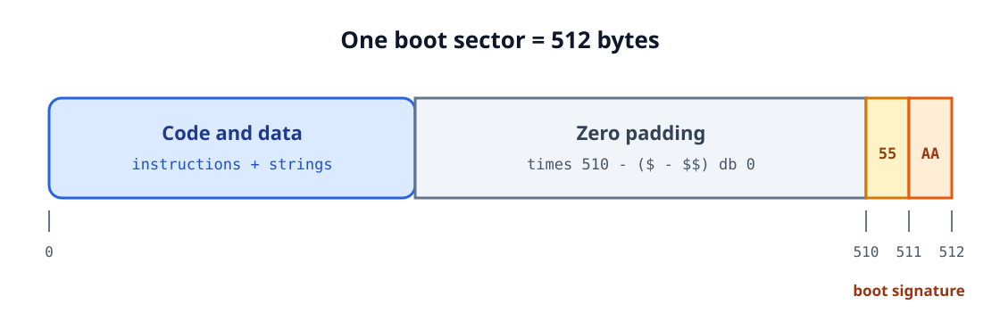

<div align="center">

<sub>AOS TUTORIALS · LESSON 00</sub>

<h1>Writing Your First Boot Sector</h1>

<p><strong>Start an x86 machine with 512 bytes of your own code</strong></p>

<p>
  <kbd>16-bit x86</kbd>
  <kbd>BIOS</kbd>
  <kbd>NASM</kbd>
  <kbd>Boot sector</kbd>
</p>

</div>

## What you will build

This lesson creates the smallest useful program in the series: a boot sector that
the BIOS can load directly from a disk.

| Artifact | Size | Purpose |
|---|---:|---|
| `boot.bin` | 512 bytes | Bootable machine code and the BIOS boot signature |
| `lesson-00.img` | 1,474,560 bytes | A standard 1.44 MiB floppy image containing `boot.bin` |
| Screen output | One line | `Peace be upon you!` |

The program will:

1. Initialize its data segments and stack.
2. Ask the BIOS to print a zero-terminated string.
3. Stop safely after the message is displayed.

<p align="center">
  
</p>

## 1. What happens when a PC boots

On a traditional BIOS-based x86 machine, the firmware performs its hardware checks,
selects a boot device, and reads the device's first 512-byte sector into memory at
physical address `0x7C00`.

If the sector ends with the required boot signature, the BIOS transfers control to
the loaded machine code. The processor is still in **16-bit real mode**, so BIOS
interrupt services are available.

The BIOS also places the selected boot drive number in `DL`. We do not need that
value yet, but Lesson 01 will preserve it before reading the kernel from disk.

!!! important

    The code is loaded at physical address `0x7C00`, but BIOS implementations may
    represent the entry point as either `0x0000:0x7C00` or `0x07C0:0x0000`.
    Do not assume useful initial values for `DS`, `ES`, `SS`, or `SP`.

### Real-mode addresses

Real mode combines a 16-bit segment with a 16-bit offset:

<table>
  <tr>
    <td><strong>Rule</strong></td>
    <td><code>physical address = segment * 16 + offset</code></td>
  </tr>
  <tr>
    <td><strong>Our boot sector</strong></td>
    <td><code>0x07C0 * 0x10 + 0x0000 = 0x7C00</code></td>
  </tr>
</table>

This lesson assembles labels as offsets beginning at zero with `[ORG 0]`, then loads
`DS` and `ES` with `0x07C0`. A label such as `bootMsg` therefore refers to the correct
location inside the sector.

## 2. Anatomy of a boot sector

A BIOS boot sector is exactly 512 bytes:

<p align="center">
  
</p>

| Region | Contents |
|---|---|
| Bytes `0-509` | Instructions, strings, and padding |
| Byte `510` | Signature byte `0x55` |
| Byte `511` | Signature byte `0xAA` |

NASM writes the signature with:

```nasm
dw 0xAA55
```

x86 stores a word in little-endian order, so the resulting bytes on disk are
`55 AA`.

The instruction below inserts exactly enough zero bytes to place the signature at
offset 510:

```nasm
times 510 - ($ - $$) db 0
```

Here `$` is the current assembly position and `$$` is the beginning of the current
section. If the program grows beyond 510 bytes, NASM reports an error instead of
silently producing an invalid sector.

## 3. Establishing a known environment

The BIOS loaded the code, but our program must initialize the registers it depends
on.

```nasm
cli

mov ax, 0x07C0
mov ds, ax
mov es, ax

mov ax, 0x9000
mov ss, ax
mov sp, 0xFFFF

cld
sti
```

| Instruction | Purpose |
|---|---|
| `cli` | Temporarily disable maskable interrupts while replacing the stack. |
| `DS = ES = 0x07C0` | Make data offsets refer to the loaded boot sector. |
| `SS:SP = 0x9000:0xFFFF` | Place the stack near the top of conventional memory. |
| `cld` | Make string instructions advance from lower to higher addresses. |
| `sti` | Re-enable maskable interrupts after initialization. |

Updating `SS` and `SP` while interrupts are disabled prevents an interrupt handler
from using a half-initialized stack.

## 4. Printing with BIOS INT 10h

BIOS interrupt `INT 10h` provides video services. Function `AH = 0Eh` is teletype
output: it prints the character in `AL` and advances the cursor.

| Register | Value |
|---|---|
| `AH` | `0x0E`, teletype output |
| `AL` | Character to print |
| `BH` | Display page, `0` |
| `BL` | Foreground color, `7` when relevant |

The message routine reads one byte at a time from `DS:SI`:

```nasm
ShowMsg:
    push ax
    push bx
    push si

.loop:
    lodsb
    test al, al
    jz .done

    mov ah, 0x0E
    mov bx, 0x0007
    int 0x10
    jmp .loop

.done:
    pop si
    pop bx
    pop ax
    ret
```

`LODSB` loads the byte at `DS:SI` into `AL` and advances `SI`. A zero byte marks the
end of the string.

```nasm
bootMsg db "Peace be upon you!", 13, 10, 0
```

The final bytes mean:

- `13` - carriage return.
- `10` - line feed.
- `0` - string terminator.

## 5. Complete boot-sector source

Save the following program as `lesson 00/src/boot.s`:

```nasm
; AOS Lesson 00 - Writing your first boot sector

[BITS 16]
[ORG 0]

EntryPoint:
    ; Establish known data segments and a safe stack.
    cli

    mov ax, 0x07C0
    mov ds, ax
    mov es, ax

    mov ax, 0x9000
    mov ss, ax
    mov sp, 0xFFFF

    cld
    sti

    mov si, bootMsg
    call ShowMsg

.hang:
    cli
    hlt
    jmp .hang

; Print the zero-terminated string at DS:SI with BIOS teletype output.
ShowMsg:
    push ax
    push bx
    push si

.loop:
    lodsb
    test al, al
    jz .done

    mov ah, 0x0E
    mov bx, 0x0007
    int 0x10
    jmp .loop

.done:
    pop si
    pop bx
    pop ax
    ret

bootMsg db "Peace be upon you!", 13, 10, 0

times 510 - ($ - $$) db 0
dw 0xAA55
```

After printing the message, `CLI` disables maskable interrupts and `HLT` stops the
processor until an event wakes it. The backward jump ensures that execution can never
fall into the padding bytes.

The same source is available in the repository:
[lesson 00/src/boot.s](https://github.com/yelouafi/aos/blob/main/lesson%2000/src/boot.s).

## 6. Assemble and inspect the sector

NASM's `bin` output format writes the assembled bytes directly, without an executable
header or linker metadata:

```sh
mkdir -p "lesson 00/build"
nasm -f bin "lesson 00/src/boot.s" -o "lesson 00/build/boot.bin"
```

Confirm that the result is exactly 512 bytes:

```sh
wc -c "lesson 00/build/boot.bin"
```

Inspect the final two bytes:

```sh
od -An -tx1 -j 510 -N 2 "lesson 00/build/boot.bin"
```

Expected signature:

```text
55 aa
```

The included Makefile performs the same checks:

```sh
make -C "lesson 00"
make -C "lesson 00" inspect
```

Expected output:

```text
size: 512 bytes
signature: 55 aa
```

## 7. Create and run a floppy image

Create a standard 1.44 MiB floppy image and write the boot sector into its first
sector:

```sh
make -C "lesson 00" image
```

The image is written to:

```text
lesson 00/build/lesson-00.img
```

If `qemu-system-i386` is installed, start the image with:

```sh
make -C "lesson 00" run
```

The Makefile uses:

```sh
qemu-system-i386 \
  -drive file=build/lesson-00.img,format=raw,if=floppy \
  -boot order=a
```

QEMU should open a display containing:

```text
Peace be upon you!
```

### Troubleshooting

| Symptom | Check |
|---|---|
| The BIOS says no bootable device exists. | Confirm the file is 512 bytes and ends in `55 aa`. |
| The emulator opens but prints nothing. | Confirm `DS = 0x07C0`, `SI = bootMsg`, and `AH = 0x0E`. |
| NASM reports a negative `TIMES` value. | The code and data exceed the 510 bytes available before the signature. |
| QEMU treats the image as a hard disk. | Keep `format=raw,if=floppy` in the `-drive` option. |

## 8. Next: load a kernel

The boot sector can now execute and communicate with the screen, but all of its code
still fits inside one 512-byte sector.

[Lesson 01 - Loading the Kernel from a Floppy Disk](../01-loading-the-kernel/index.md)
uses BIOS disk service `INT 13h` to read a second sector into memory and transfer
execution to a separate kernel program.
