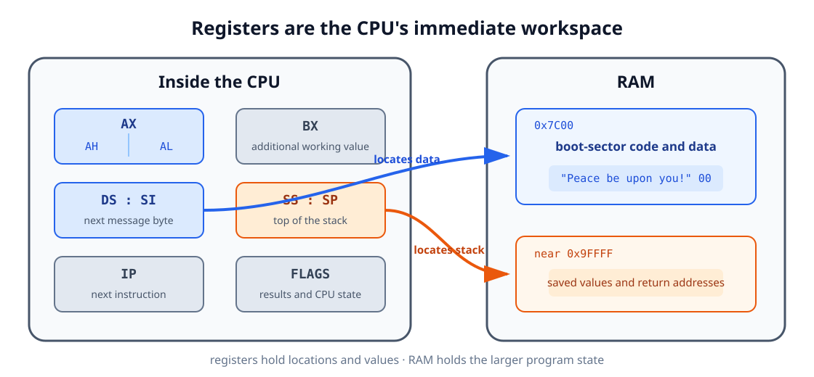

<div align="center">

<sub>AOS TUTORIALS · LESSON 00</sub>

<h1>Writing Your First Boot Sector</h1>

<p><strong>From CPU, memory, and registers to your first bootable program</strong></p>

<p>
  <kbd>PC architecture</kbd>
  <kbd>x86 basics</kbd>
  <kbd>NASM</kbd>
  <kbd>BIOS</kbd>
</p>

</div>

## Before we begin

This lesson assumes that you have **no previous system-programming or assembly
knowledge**. If you can open a terminal and edit a text file, you are ready.

We will begin with the pieces inside a PC and gradually work toward a small program
that starts without Windows, Linux, or any other operating system.

By the end, you will understand:

- The different jobs of the CPU, memory, storage, firmware, and peripherals.
- How a CPU sees instructions, data, memory addresses, and registers.
- Why assembly source code must be translated into machine code.
- How the stack, labels, loops, and subroutines work.
- How the BIOS finds and starts a 512-byte boot sector.

You will also produce:

| Artifact | Size | Purpose |
|---|---:|---|
| `boot.bin` | 512 bytes | Bootable machine code and the BIOS boot signature |
| `lesson-00.img` | 1,474,560 bytes | A floppy-disk image containing `boot.bin` |
| Screen output | One line | `Peace be upon you!` |

!!! note "Take your time"

    The program is short, but every line interacts directly with the machine.
    Understanding the ideas matters more than memorizing the instructions.

## 1. The main parts of a PC

An application normally sits on top of an operating system. The operating system
handles the hardware, so the application rarely needs to know how the machine starts
or how a character reaches the screen.

We are going below that layer. Five parts are especially important:

### CPU

The **central processing unit**, or CPU, executes instructions. An instruction might
copy a number, compare two values, read a byte from memory, or jump to another part
of a program.

The CPU repeatedly performs a simple cycle:

1. Fetch the next instruction from memory.
2. Decode what the instruction means.
3. Execute it.
4. Continue with the next instruction, unless the current instruction says to jump.

The CPU can execute only **machine code**: bytes whose bit patterns represent
instructions. It cannot directly execute a NASM source file.

### Memory (RAM)

**RAM** is the machine's temporary working area. Programs must be copied into RAM
before the CPU can execute them. The contents disappear when power is removed.

Memory is a long sequence of numbered byte-sized locations. The number of a location
is its **address**. If a byte is stored at address `0x7C00`, the CPU can use that
address to find it again.

### Storage

A floppy disk, hard disk, or solid-state drive provides persistent **storage**.
Its contents remain after the machine is turned off.

Storage and RAM are not interchangeable:

| Storage | RAM |
|---|---|
| Keeps files and disk sectors persistently | Holds the program and data currently in use |
| Read through a storage controller or firmware service | Read directly by the CPU |
| Usually much larger but slower | Usually smaller but faster |

At startup, our code is on storage. Before it can run, something must copy it into
RAM.

### Firmware (BIOS)

The **BIOS** is firmware supplied with a traditional PC. It is the first software
that runs after power-on. It initializes hardware, chooses a boot device, and loads
the first piece of our program.

The BIOS also provides small routines for tasks such as reading a disk sector or
printing a character. Our first program will ask one of those routines to display
text.

### Peripherals

The display, keyboard, disk drive, and similar devices are **peripherals**. The CPU
communicates with them through controllers. In this lesson we let the BIOS handle
the display controller for us.

<p align="center">
  
</p>

The important path is:

```text
disk storage → BIOS copies bytes → RAM → CPU executes bytes → screen output
```

## 2. Bits, bytes, and hexadecimal

Computers store information with two states, written as `0` and `1`. One such state
is a **bit**. Eight bits make one **byte**.

A byte can hold 256 different bit patterns, from `00000000` through `11111111`.
Writing long binary values is inconvenient, so system programmers commonly use
**hexadecimal**, a base-16 number system.

Hexadecimal uses the digits `0-9` followed by `A-F`:

| Decimal | Hexadecimal | Binary |
|---:|---:|---:|
| 0 | `0x00` | `00000000` |
| 10 | `0x0A` | `00001010` |
| 15 | `0x0F` | `00001111` |
| 16 | `0x10` | `00010000` |
| 255 | `0xFF` | `11111111` |

The prefix `0x` tells the reader that a number is hexadecimal. NASM also accepts an
`h` suffix, but this tutorial consistently uses the `0x` form.

Two terms appear frequently in x86 documentation:

- A **byte** is 8 bits.
- A **word** is 16 bits, or 2 bytes.

Hexadecimal does not change the stored value. `255`, `0xFF`, and `11111111` are
different ways to write the same number.

## 3. Memory and addresses

Imagine RAM as a very long row of numbered boxes. Each box holds one byte:

```text
Address       0x7C00  0x7C01  0x7C02  0x7C03  ...
Stored byte      FA      B8      C0      07    ...
```

The addresses identify **where** the bytes are. The values in the boxes are the
actual instructions or data.

The same bytes can mean different things depending on how a program uses them:

- A CPU instruction.
- A number.
- A letter encoded as text.
- Part of a memory address.

For example, the letter `A` is represented by the value `0x41` in ASCII, a common
text encoding. Our message will be stored as a sequence of such byte values followed
by a zero byte.

### The address of our boot sector

The BIOS copies the first disk sector to memory beginning at physical address
`0x7C00`. If our sector contains 512 bytes, they occupy addresses `0x7C00` through
`0x7DFF`.

The CPU needs a reliable way to refer to code and data in that region. Early x86
addressing uses a **segment** and an **offset**:

```text
physical address = segment × 16 + offset
```

For our program:

```text
0x07C0 × 0x10 + 0x0000 = 0x7C00
```

You do not need to explore every x86 addressing scheme yet. For now, remember only
that we will use segment `0x07C0` as the base of the loaded boot sector, and labels
inside it will be offsets from that base.

## 4. Registers: the CPU's immediate workspace

Reading RAM is fast, but the CPU has an even smaller workspace inside itself:
**registers**. Registers hold the values that the current instructions need
immediately.

Unlike variables in a high-level language, x86 registers have fixed names and
special conventional uses.

<p align="center">
  
</p>

### Registers used in this lesson

| Register | Role in our program |
|---|---|
| `AX` | General working register and BIOS function selection |
| `AH` / `AL` | Upper and lower 8-bit halves of `AX` |
| `BX` | Supplies display page and color values to the BIOS |
| `SI` | Holds the offset of the next message character |
| `DS` | Holds the base segment for our data |
| `ES` | A second data segment, initialized now for predictable later use |
| `SS` | Holds the base segment of the stack |
| `SP` | Holds the offset of the top of the stack |
| `IP` | Points to the next instruction; the CPU updates it automatically |

`AX` is a 16-bit register. Its two halves can also be addressed separately:

```text
AX
┌───────────────┬───────────────┐
│ AH: high byte │ AL: low byte  │
└───────────────┴───────────────┘
```

This is why one BIOS call can use `AH` to select an operation while using `AL` for
the character involved in that operation.

### Flags

The CPU also maintains individual state bits called **flags**. An instruction such
as `TEST` updates flags to describe its result. A following instruction such as
`JZ` can jump when the result was zero.

Our loop uses this pair to detect the zero byte at the end of the message.

### The stack

The **stack** is an area of RAM used in last-in, first-out order:

```text
push AX  → save AX on top of the stack
push BX  → save BX above it
pop BX   → restore the most recently saved value
pop AX   → restore the value saved before that
```

`SS` and `SP` locate the top of the stack. The stack grows toward lower addresses.
It is used for temporary values and for return addresses when one part of a program
calls another part.

## 5. From assembly source to machine code

Machine code is difficult for humans to read and write directly. **Assembly
language** gives names to machine instructions.

For example:

```nasm
mov ax, 0x07C0
```

This asks the CPU to copy the value `0x07C0` into register `AX`.

An **assembler** translates the readable instruction into the corresponding machine
code bytes. We use NASM:

```text
boot.s  ──NASM──>  boot.bin
source text          machine-code bytes
```

Assembly source contains several kinds of line:

| Kind | Example | Meaning |
|---|---|---|
| Instruction | `mov ds, ax` | An operation the CPU will execute |
| Label | `ShowMsg:` | A name for a location in the program |
| Directive | `[BITS 16]` | Information for NASM, not a CPU instruction |
| Data definition | `db "Hello", 0` | Bytes to include in the output file |
| Comment | `; initialize the stack` | Explanation ignored by NASM |

### A few instructions before we use them

| Instruction | Plain-language meaning |
|---|---|
| `mov destination, source` | Copy a value |
| `call label` | Run a subroutine and remember where to return |
| `ret` | Return to the instruction after `call` |
| `jmp label` | Continue at another label |
| `push register` | Save a register value on the stack |
| `pop register` | Restore a value from the stack |
| `int number` | Request a software service; here, a BIOS routine |
| `hlt` | Stop executing instructions until the CPU is awakened |

!!! important

    In NASM syntax the destination comes first. `mov ax, 5` copies `5` into `AX`;
    it does not copy `AX` into the number `5`.

## 6. How the BIOS starts our program

After the PC is powered on, the BIOS:

1. Initializes enough hardware to begin booting.
2. Chooses a boot device.
3. Reads that device's first 512-byte sector into memory at `0x7C00`.
4. Checks for a recognizable signature in the final two bytes.
5. Tells the CPU to begin executing the copied instructions.

<p align="center">
  
</p>

That first sector is called the **boot sector**. It is not a normal application
file: there is no operating system to load it, no executable header, and no runtime
library. The sector contains only the bytes the BIOS and CPU need.

The BIOS also leaves the number of the selected boot drive in register `DL`. We will
save and use it in Lesson 01. This first program does not read more data from disk,
so it does not need the number yet.

## 7. Anatomy of a boot sector

A BIOS boot sector is exactly 512 bytes:

<p align="center">
  
</p>

| Region | Contents |
|---|---|
| Bytes `0-509` | Instructions, strings, and padding |
| Byte `510` | Signature byte `0x55` |
| Byte `511` | Signature byte `0xAA` |

NASM writes the signature with:

```nasm
dw 0xAA55
```

`DW` means **define word**, so NASM emits a 2-byte value. x86 stores the lower byte
first, which turns the word `0xAA55` into the disk bytes `55 AA`.

The instruction below inserts exactly enough zero bytes to place the signature at
offset 510:

```nasm
times 510 - ($ - $$) db 0
```

The symbols have special meanings to NASM:

- `$` is the current position.
- `$$` is the beginning of the current section.
- `$ - $$` is therefore the number of bytes emitted so far.
- `DB 0` means emit one zero byte.

If the program grows beyond the available 510 bytes, NASM reports an error instead
of silently creating an invalid sector.

## 8. Building the program one idea at a time

We can now build the program without treating any line as magic.

### Step 1: tell NASM what we are producing

```nasm
[BITS 16]
[ORG 0]
```

`BITS 16` tells NASM which instruction encoding the CPU expects at startup.

`ORG 0` tells NASM to calculate labels as offsets beginning at zero. We will place
`0x07C0` in `DS`, so `DS` supplies the base address `0x7C00` and each label supplies
an offset within the loaded sector.

### Step 2: initialize the data registers and stack

The BIOS gave control to our code, but our code should not assume that data and
stack registers already contain useful values.

```nasm
EntryPoint:
    cli

    mov ax, 0x07C0
    mov ds, ax
    mov es, ax

    mov ax, 0x9000
    mov ss, ax
    mov sp, 0xFFFF

    cld
    sti
```

Line by line:

| Code | Meaning |
|---|---|
| `cli` | Temporarily prevent ordinary hardware events from interrupting stack setup |
| `mov ax, 0x07C0` | Put the boot-sector base segment in a general register |
| `mov ds, ax` | Make data labels refer to the loaded boot sector |
| `mov es, ax` | Initialize the second data segment to the same base |
| `mov ax, 0x9000` | Choose a separate region for the stack |
| `mov ss, ax` | Set the stack's base segment |
| `mov sp, 0xFFFF` | Set its starting top offset |
| `cld` | Make string-reading instructions advance toward higher addresses |
| `sti` | Allow maskable hardware interrupts again |

x86 does not allow a constant to be copied directly into a segment register, so the
value travels through `AX`: first `mov ax, 0x07C0`, then `mov ds, ax`.

The `CLI`/`STI` pair is safe initialization boilerplate for now. It creates a short
quiet period while the stack changes. Interrupt handling will receive its own lesson
later.

### Step 3: store the message

```nasm
bootMsg db "Peace be upon you!", 13, 10, 0
```

`DB` means **define bytes**. NASM converts the quoted characters to their text byte
values, then appends:

- `13`: carriage return, moving the cursor to the start of the line.
- `10`: line feed, moving the cursor down one line.
- `0`: a terminator that marks the end of the string.

The zero is not displayed. It is simply an end marker our loop can recognize.

### Step 4: point to the first character

```nasm
mov si, bootMsg
call ShowMsg
```

`bootMsg` is a label. NASM replaces it with the offset where those message bytes were
placed.

Together, `DS:SI` identifies the next message byte:

- `DS` supplies the boot sector's base.
- `SI` supplies the offset of the current character.

`CALL` begins the `ShowMsg` subroutine. It also saves a return address on the stack,
allowing `RET` to resume at the instruction after the call.

### Step 5: read the message one byte at a time

Assembly has no built-in string object that remembers its own length. Our “string”
is simply a sequence of character bytes stored next to one another in memory.
`bootMsg` names the address of the first byte.

Here is a shorter example:

```nasm
message db "Hi", 0
```

NASM stores it as:

| Offset from `message` | Stored byte | Meaning |
|---:|---:|---|
| `0` | `0x48` | `H` |
| `1` | `0x69` | `i` |
| `2` | `0x00` | End of the string |

This convention is called a **null-terminated string**. “Null” means the zero byte
`0x00`. It is not a displayed character; it tells the reading loop where to stop.
Without that final zero, the loop would continue into whatever bytes happen to
follow the message in memory.

Our complete message works the same way:

```nasm
bootMsg db "Peace be upon you!", 13, 10, 0
```

It contains the text bytes, the carriage-return and line-feed bytes, and finally the
zero terminator.

```nasm
ShowMsg:
    push ax
    push bx
    push si

.loop:
    lodsb
    test al, al
    jz .done

    mov ah, 0x0E
    mov bx, 0x0007
    int 0x10
    jmp .loop

.done:
    pop si
    pop bx
    pop ax
    ret
```

The routine first saves the registers it will change. It restores them in reverse
order before returning.

On each pass, `LODSB` places the next byte in `AL`. `TEST AL, AL` tests the value
against itself; its result can be zero only when `AL` is zero. The CPU then sets its
zero flag. If `AL` contains the null terminator, `JZ .done` sees that flag, follows
the jump, and finishes the routine. Otherwise, the byte is a character and the BIOS
displays it.

The loop works like this:

| Instruction | Effect |
|---|---|
| `lodsb` | Load the byte at `DS:SI` into `AL`, then advance `SI` |
| `test al, al` | Check whether that byte is zero |
| `jz .done` | Leave the loop when the terminator is reached |
| `mov ah, 0x0E` | Select the BIOS teletype-output service |
| `mov bx, 0x0007` | Select display page 0 and a standard text color |
| `int 0x10` | Ask the BIOS to display the character in `AL` |
| `jmp .loop` | Repeat for the next byte |

The BIOS call uses registers as a tiny request form:

| Register | Request field |
|---|---|
| `AH = 0x0E` | Operation: print one character |
| `AL` | Character to print |
| `BH = 0` | Display page |
| `BL = 7` | Foreground color when relevant |

### Step 6: stop after returning

```nasm
.hang:
    cli
    hlt
    jmp .hang
```

There is no operating system to return to and no next application to launch. After
the message is printed, the program prevents ordinary hardware interrupts and
halts. The backward jump ensures that it can never continue into padding bytes if
the CPU is awakened.

## 9. Complete boot-sector source

The ideas above form the complete `lesson 00/src/boot.s` program:

```nasm
; AOS Lesson 00 - Writing your first boot sector

[BITS 16]
[ORG 0]

EntryPoint:
    ; Establish known data segments and a safe stack.
    cli

    mov ax, 0x07C0
    mov ds, ax
    mov es, ax

    mov ax, 0x9000
    mov ss, ax
    mov sp, 0xFFFF

    cld
    sti

    mov si, bootMsg
    call ShowMsg

.hang:
    cli
    hlt
    jmp .hang

; Print the zero-terminated string at DS:SI with BIOS teletype output.
ShowMsg:
    push ax
    push bx
    push si

.loop:
    lodsb
    test al, al
    jz .done

    mov ah, 0x0E
    mov bx, 0x0007
    int 0x10
    jmp .loop

.done:
    pop si
    pop bx
    pop ax
    ret

bootMsg db "Peace be upon you!", 13, 10, 0

times 510 - ($ - $$) db 0
dw 0xAA55
```

The same source is available in the repository:
[lesson 00/src/boot.s](https://github.com/yelouafi/aos/blob/main/lesson%2000/src/boot.s).

### Trace the whole execution

Before assembling it, follow the program once from start to finish:

1. The BIOS copies the sector from disk to memory at `0x7C00`.
2. The CPU begins at `EntryPoint`.
3. The program initializes its data registers and stack.
4. `SI` receives the offset of `bootMsg`.
5. `CALL` saves a return address and enters `ShowMsg`.
6. `LODSB` reads one character into `AL`.
7. If the character is not zero, `INT 10h` displays it.
8. The loop repeats until the zero terminator is found.
9. `RET` uses the saved return address to leave `ShowMsg`.
10. The program enters its halt loop.

## 10. Assemble and inspect the sector

NASM's `bin` output format writes the assembled bytes directly, without an
application header or extra metadata:

```sh
mkdir -p "lesson 00/build"
nasm -f bin "lesson 00/src/boot.s" -o "lesson 00/build/boot.bin"
```

The quotation marks are necessary because the directory name contains a space.

Confirm that the output is exactly 512 bytes:

```sh
wc -c "lesson 00/build/boot.bin"
```

Inspect the final two bytes:

```sh
od -An -tx1 -j 510 -N 2 "lesson 00/build/boot.bin"
```

Expected signature:

```text
55 aa
```

The included Makefile performs the same build and checks:

```sh
make -C "lesson 00"
make -C "lesson 00" inspect
```

Expected output:

```text
size: 512 bytes
signature: 55 aa
```

## 11. Create and run a floppy image

A disk image is a file containing the bytes of an entire disk. Create a standard
1.44 MiB floppy image and put the boot sector in its first 512 bytes:

```sh
make -C "lesson 00" image
```

The result is:

```text
lesson 00/build/lesson-00.img
```

If `qemu-system-i386` is installed, start the virtual PC with:

```sh
make -C "lesson 00" run
```

The Makefile uses:

```sh
qemu-system-i386 \
  -drive file=build/lesson-00.img,format=raw,if=floppy \
  -boot order=a
```

QEMU should open a display containing:

```text
Peace be upon you!
```

### Troubleshooting

| Symptom | Check |
|---|---|
| NASM is not found. | Install NASM and confirm that `nasm -v` works in your terminal. |
| The BIOS reports no bootable device. | Confirm that the file is 512 bytes and ends in `55 aa`. |
| The emulator prints nothing. | Confirm `DS = 0x07C0`, `SI = bootMsg`, and `AH = 0x0E`. |
| NASM reports a negative `TIMES` value. | The code and data exceed the 510 bytes available before the signature. |
| QEMU treats the image as a hard disk. | Keep `format=raw,if=floppy` in the `-drive` option. |

## 12. What you have learned

You began with the basic parts of a PC and followed a program through every layer:

```text
assembly source
      ↓ NASM
machine-code bytes
      ↓ written to sector 1
floppy image
      ↓ BIOS copies it
RAM at 0x7C00
      ↓ CPU executes it
message on the screen
```

The boot sector can now execute instructions, find data in memory, use a stack, call
a subroutine, loop over a string, and communicate with the screen.

[Lesson 01 - Loading the Kernel from a Floppy Disk](../01-loading-the-kernel/index.md)
builds on those foundations. It uses a BIOS disk service to copy a second program
from storage into memory, then transfers control to that program.
