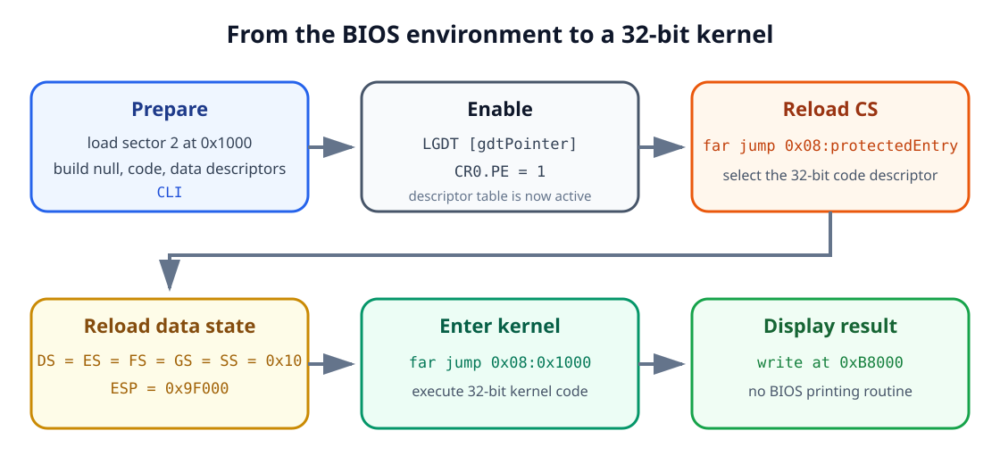
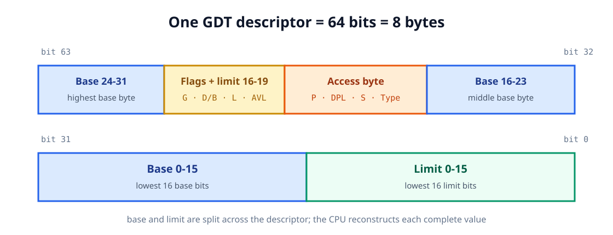
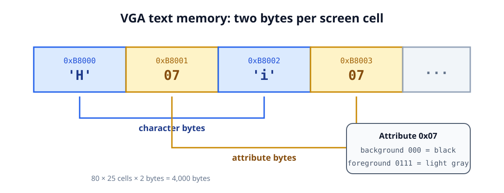

<div align="center">

<sub>AOS TUTORIALS · LESSON 02</sub>

<h1>Entering 32-bit Protected Mode</h1>

<p><strong>Move from the BIOS startup environment to a 32-bit kernel</strong></p>

<p>
  <kbd>x86</kbd>
  <kbd>Protected mode</kbd>
  <kbd>GDT</kbd>
  <kbd>VGA text memory</kbd>
</p>

</div>

## What you will build

[Lesson 01](../01-loading-the-kernel/index.md) ended with a boot sector that loaded a
second program from disk and jumped to it. Both programs still used the CPU's
original startup environment and asked the BIOS to print text.

This lesson takes the next step. The boot sector will:

1. Load a 32-bit kernel from sector 2.
2. Describe the memory layout with a **Global Descriptor Table**, or GDT.
3. Enable **protected mode** in control register `CR0`.
4. Reload the CPU's code and data segments.
5. Transfer control to the kernel at address `0x1000`.

The kernel will then clear the display and print:

```text
Protected mode is active.
```

It cannot use the old BIOS printing routine, so it will write characters directly
to VGA text memory.

| Item | Location | Purpose |
|---|---:|---|
| Boot sector | `0x7C00` | Load the kernel and change CPU mode |
| Kernel | `0x1000` | Run 32-bit instructions |
| VGA text buffer | `0xB8000` | Hold screen characters and colors |
| GDT | Inside the boot sector | Describe the code and data address spaces |

<p align="center">
  
</p>

## 1. How the CPU reaches memory and devices

Lesson 00 introduced the CPU, RAM, storage, and peripherals. We now need a little
more detail about how values move between them.

Electronic paths called **buses** connect the CPU to memory and hardware
controllers. A simplified PC exposes four kinds of signal:

| Signal group | Job |
|---|---|
| Address | Select a memory location or hardware port |
| Data | Carry the value being read or written |
| Control | Describe the operation, such as read or write |
| Power and timing | Supply energy and coordinate the transfer |

### Address width and address space

If the CPU has `n` usable address bits, it can form `2^n` distinct addresses.

| Address bits | Number of distinct byte addresses |
|---:|---:|
| 16 | `2^16 = 65,536` |
| 20 | `2^20 = 1,048,576` (1 MiB) |
| 32 | `2^32 = 4,294,967,296` (4 GiB) |

!!! important

    An address space is the set of addresses the CPU **can express**. It is not the
    amount of RAM physically installed in the computer.

The original 8086 exposed 20 address lines, covering the first 1 MiB. BIOS-compatible
startup preserves that layout, including the historical A20 boundary behavior. In
the 32-bit flat layout built later, code can use 32-bit offsets across a 4 GiB linear
address space.

### Data width

Address lines select a location. Data lines determine how much information can be
transferred at once.

| Width | x86 name |
|---:|---|
| 8 bits | Byte |
| 16 bits | Word |
| 32 bits | Doubleword, or `dword` |

The CPU's general-purpose registers also have different widths. `AX` is 16 bits,
while `EAX` is its 32-bit extension.

### Little-endian byte order

Memory is addressed one byte at a time. When x86 stores a value wider than one byte,
it puts the least-significant byte at the lowest address.

For the 16-bit value `0x1234`:

| Address | Stored byte |
|---:|---:|
| `n` | `0x34` |
| `n + 1` | `0x12` |

This is called **little-endian** order. When the CPU reads the word again, it
reconstructs the original value `0x1234`.

### Three ways to communicate

The lesson's original hardware review distinguishes three common paths:

1. **Memory access** - the CPU reads and writes addressed bytes in RAM.
2. **Input/output access** - the CPU communicates with a controller through a
   separate port number or through a memory-mapped region.
3. **Interrupts** - a device or CPU event asks the processor to pause its current
   sequence and handle an event.

Port numbers belong to an I/O address space; they are not RAM addresses. For
example, I/O port `0x3D0` and memory address `0x3D0` do not name the same thing.

We will keep interrupts disabled during the mode switch because we have not created
protected-mode interrupt handlers yet.

## 2. From startup segmentation to protected mode

We deliberately postponed CPU-mode terminology in Lesson 00. Now the distinction is
necessary.

### Real-mode addresses

The environment in which the BIOS starts our boot sector is called **real mode**.
An address is formed from a 16-bit segment and a 16-bit offset:

```text
physical address = segment × 16 + offset
```

The same physical location can therefore have more than one segment:offset spelling.

```text
0x3415:0x0055 → 0x34150 + 0x0055 → 0x341A5
0x341A:0x0005 → 0x341A0 + 0x0005 → 0x341A5
```

Our previous lessons used:

```text
0x07C0:0x0000 → boot sector at physical 0x7C00
0x0100:0x0000 → kernel at physical 0x1000
```

This scheme maintains compatibility with the earliest x86 processors, but it gives
us 16-bit defaults. Segment arithmetic can nominally reach slightly beyond 1 MiB on
later CPUs; whether those addresses wrap depends on the A20 address line. Everything
in this lesson deliberately stays below that boundary.

### Protected-mode addresses

In protected mode, a segment register no longer contains a segment base to multiply
by 16. It contains a **segment selector**:

```text
selector : 32-bit offset
```

The selector chooses a descriptor from a table. The descriptor supplies the actual
base address, limit, type, and access rules. The CPU checks those rules before using
the resulting address.

This indirection is what makes features such as privilege levels and memory-region
validation possible.

!!! note "A third historical mode"

    The source lesson also mentions virtual-8086 mode, which allows software to run
    certain 8086-style programs under a protected-mode operating system. We do not
    need it for this kernel.

### The flat memory model

This lesson creates one code descriptor and one data descriptor. Both have:

- Base address `0`.
- Limit covering the entire 4 GiB linear address space.
- Privilege level `0`, the most privileged level.

Because their base is zero, each offset is already the corresponding linear
address. This is called a **flat memory model**:

```text
linear address = descriptor base 0 + offset
```

Segmentation still exists, but it no longer shifts our addresses.

## 3. Selectors and the Global Descriptor Table

The **Global Descriptor Table** is an array of 8-byte entries in memory. Each entry
describes one segment.

Our table contains:

| Index | Selector | Entry |
|---:|---:|---|
| 0 | `0x00` | Required null descriptor |
| 1 | `0x08` | 32-bit code segment |
| 2 | `0x10` | 32-bit data and stack segment |

Why does index 1 become selector `0x08` rather than `0x01`? The selector's low three
bits carry flags; the remaining bits hold the table index.

```text
selector = index × 8
```

Therefore:

```text
1 × 8 = 0x08  → code descriptor
2 × 8 = 0x10  → data descriptor
```

<p align="center">
  
</p>

### The null descriptor

The first GDT entry must be unusable. A selector value of zero therefore means “no
segment” rather than accidentally selecting valid memory.

```nasm
gdtNull:
    dq 0
```

`DQ` defines one 8-byte quantity, so this emits eight zero bytes.

### What is inside a descriptor?

An x86 code or data descriptor is 64 bits:

<p align="center">
  
</p>

The main fields are:

| Field | Purpose |
|---|---|
| Base | 32-bit starting linear address of the segment |
| Limit | 20-bit maximum offset inside the segment |
| Type | Code/data kind and allowed operations |
| `S` | `1` for a normal code or data descriptor |
| `DPL` | Privilege level, from 0 to 3 |
| `P` | Present bit; `1` means the descriptor is usable |
| `D/B` | `1` selects 32-bit code or stack behavior |
| `G` | Granularity: bytes when `0`, 4 KiB units when `1` |
| `AVL` | Bit available for software use |

The 20-bit limit can hold at most `0xFFFFF`. With `G = 1`, that value is interpreted
in 4 KiB units and covers offsets through `0xFFFFFFFF` - the full 4 GiB range.

### Our code descriptor

```nasm
gdtCode:
    dw 0xFFFF
    dw 0x0000
    db 0x00
    db 10011010b
    db 11001111b
    db 0x00
```

Its bytes are:

```text
FF FF 00 00 00 9A CF 00
```

The access byte `0x9A` means present, privilege level 0, normal code/data
descriptor, executable, and readable. The flags/limit byte `0xCF` enables 4 KiB
granularity and 32-bit instructions while supplying the high four limit bits.

### Our data descriptor

```nasm
gdtData:
    dw 0xFFFF
    dw 0x0000
    db 0x00
    db 10010010b
    db 11001111b
    db 0x00
```

Its access byte `0x92` describes present, privilege-level-0, writable data. Its base,
limit, and 32-bit/granularity flags match the code descriptor.

### Telling the CPU where the GDT lives

The CPU has a special **GDTR** register containing:

- A 16-bit table limit, stored as table size minus one.
- A 32-bit linear base address.

Our pointer is:

```nasm
gdtPointer:
    dw gdtEnd - gdtStart - 1
    dd BOOT_ADDRESS + gdtStart
```

`gdtStart` is an offset because the boot source uses `[ORG 0]`. Adding the physical
boot address `0x7C00` produces the linear address required by `LGDT`.

## 4. The mode-switch sequence

Changing mode is a short sequence, but the order matters.

### Step 1: disable interrupts

```nasm
cli
```

The old BIOS interrupt table is not a protected-mode interrupt table. We prevent
ordinary hardware interrupts until a later lesson creates the required structures
and handlers.

### Step 2: load the GDT register

```nasm
lgdt [gdtPointer]
```

`LGDT` copies the limit and base from `gdtPointer` into the CPU's GDTR register.
The descriptors themselves remain in RAM.

### Step 3: set the protected-enable bit

Control register `CR0` contains system-wide CPU settings. Its least-significant bit
is `PE`, the protected-enable bit.

```nasm
mov eax, cr0
or eax, 0x00000001
mov cr0, eax
```

Reading and modifying the existing value preserves every unrelated control bit.

### Step 4: reload the code segment

Setting `CR0.PE` does not by itself replace the cached description of the current
code segment. A **far jump** loads `CS` with selector `0x08` and begins using our
32-bit code descriptor:

```nasm
jmp dword CODE_SELECTOR:(BOOT_ADDRESS + protectedEntry)
```

The descriptor's base is zero, so the jump offset must be the target's linear
address. `protectedEntry` is an offset inside a sector loaded at `0x7C00`; that is
why the expression adds `BOOT_ADDRESS`.

### Step 5: assemble and run the new instructions as 32-bit code

```nasm
[BITS 32]
protectedEntry:
```

`BITS 32` is a NASM directive. It tells the assembler how to encode the following
instructions. It does **not** switch the CPU by itself; the GDT, `CR0.PE`, and far
jump performed the actual transition.

### Step 6: reload data segments and the stack

```nasm
mov ax, DATA_SELECTOR
mov ds, ax
mov es, ax
mov fs, ax
mov gs, ax
mov ss, ax
mov esp, 0x0009F000
```

Loading selector `0x10` into each data segment register makes the CPU cache the data
descriptor. `ESP` replaces the 16-bit `SP` as the stack pointer.

### Step 7: jump to the loaded kernel

```nasm
jmp dword CODE_SELECTOR:KERNEL_ADDRESS
```

The code descriptor has base zero and the kernel was loaded at linear address
`0x1000`, so the new `CS:EIP` becomes `0x08:0x00001000`.

!!! note "Why this lesson does not enable A20"

    Every address used here is below 1 MiB: the kernel is at `0x1000`, the boot
    sector at `0x7C00`, the VGA buffer at `0xB8000`, and the stack below `0xA0000`.
    A later loader must enable the A20 address line before relying on memory above
    the first MiB.

## 5. Complete boot-sector source

The boot sector includes the corrected Lesson 01 disk loader, GDT, transition code,
and BIOS error message.

<details markdown="1">
<summary><strong>Show lesson 02/src/boot.asm</strong></summary>

```nasm
; AOS Lesson 02 - Entering 32-bit protected mode

[BITS 16]
[ORG 0]

%define BOOT_SEGMENT    0x07C0
%define BOOT_ADDRESS    0x7C00
%define KERNEL_SEGMENT  0x0100
%define KERNEL_ADDRESS  0x1000

%define CODE_SELECTOR   0x08
%define DATA_SELECTOR   0x10

start:
    ; Establish known data segments and a safe stack.
    cli

    mov ax, BOOT_SEGMENT
    mov ds, ax
    mov es, ax

    mov ax, 0x9000
    mov ss, ax
    mov sp, 0xFFFF

    cld
    sti

    ; Preserve the drive selected by the BIOS.
    mov [bootDrive], dl

    mov si, loadingMessage
    call printString

    ; Reset the boot drive.
    mov dl, [bootDrive]
    xor ax, ax
    int 0x13
    jc diskError

    ; Read sector 2 into physical address 0x1000.
    mov ax, KERNEL_SEGMENT
    mov es, ax
    xor bx, bx
    mov ah, 0x02
    mov al, 0x01
    mov ch, 0x00
    mov cl, 0x02
    mov dh, 0x00
    mov dl, [bootDrive]
    int 0x13
    jc diskError

    ; Install the descriptor table and enable protected mode.
    cli
    lgdt [gdtPointer]

    mov eax, cr0
    or eax, 0x00000001
    mov cr0, eax

    ; Reload CS through the 32-bit code descriptor.
    jmp dword CODE_SELECTOR:(BOOT_ADDRESS + protectedEntry)

diskError:
    mov si, diskErrorMessage
    call printString

.hang:
    cli
    hlt
    jmp .hang

printString:
    push ax
    push bx
    push si

.loop:
    lodsb
    test al, al
    jz .done

    mov ah, 0x0E
    mov bx, 0x0007
    int 0x10
    jmp .loop

.done:
    pop si
    pop bx
    pop ax
    ret

; ---------------------------------------------------------------------------
; Global Descriptor Table
; ---------------------------------------------------------------------------

gdtStart:
gdtNull:
    dq 0

gdtCode:
    dw 0xFFFF               ; limit bits 0-15
    dw 0x0000               ; base bits 0-15
    db 0x00                 ; base bits 16-23
    db 10011010b            ; present, ring 0, code, readable
    db 11001111b            ; 4 KiB granularity, 32-bit, limit bits 16-19
    db 0x00                 ; base bits 24-31

gdtData:
    dw 0xFFFF               ; limit bits 0-15
    dw 0x0000               ; base bits 0-15
    db 0x00                 ; base bits 16-23
    db 10010010b            ; present, ring 0, data, writable
    db 11001111b            ; 4 KiB granularity, 32-bit, limit bits 16-19
    db 0x00                 ; base bits 24-31
gdtEnd:

gdtPointer:
    dw gdtEnd - gdtStart - 1
    dd BOOT_ADDRESS + gdtStart

loadingMessage   db "Loading the 32-bit kernel...", 13, 10, 0
diskErrorMessage db "Error: unable to read the kernel.", 13, 10, 0
bootDrive        db 0

; ---------------------------------------------------------------------------
; First instructions after CR0.PE becomes 1
; ---------------------------------------------------------------------------

[BITS 32]
protectedEntry:
    mov ax, DATA_SELECTOR
    mov ds, ax
    mov es, ax
    mov fs, ax
    mov gs, ax
    mov ss, ax
    mov esp, 0x0009F000

    ; The kernel was loaded at linear address 0x1000.
    jmp dword CODE_SELECTOR:KERNEL_ADDRESS

times 510 - ($ - $$) db 0
dw 0xAA55
```

</details>

## 6. Display output without the BIOS

After the mode switch, the kernel cannot directly use the BIOS `INT 10h` routine
from the previous lessons. It needs its own hardware-facing output code.

In the standard color text layout, screen memory begins at `0xB8000`. An 80-column
by 25-row display has:

```text
80 × 25 = 2,000 character cells
```

Each cell occupies two bytes:

1. The character's text code.
2. Its color attribute.

The complete screen therefore occupies `2,000 × 2 = 4,000` bytes.

<p align="center">
  
</p>

### The attribute byte

The low four bits select the foreground color. Bits 4-6 select the background color;
bit 7 traditionally controls blinking when that feature is enabled.

`0x07` means:

```text
background = 000 (black)
foreground = 0111 (light gray)
```

### Clearing the screen

The kernel writes a space and attribute `0x07` to every cell:

```nasm
mov ebx, VIDEO_MEMORY
mov ecx, SCREEN_CELLS

.clearScreen:
    mov byte [ebx], ' '
    mov byte [ebx + 1], TEXT_ATTRIBUTE
    add ebx, 2
    loop .clearScreen
```

`ECX` begins at 2,000. `LOOP` subtracts one and repeats while the result is not zero.
`EBX` advances two bytes per cell.

### Printing the message

The message is still a null-terminated sequence of bytes:

```nasm
message db "Protected mode is active.", 0
```

`ESI` points to the next message byte and `EBX` points to the next display cell:

```nasm
mov esi, message
mov ebx, VIDEO_MEMORY

.printCharacter:
    lodsb
    test al, al
    jz .hang

    mov byte [ebx], al
    mov byte [ebx + 1], TEXT_ATTRIBUTE
    add ebx, 2
    jmp .printCharacter
```

Because the data descriptor has base zero and the kernel uses `[ORG 0x1000]`, NASM
encodes `message` as its correct linear address in the loaded kernel.

## 7. Complete 32-bit kernel

```nasm
; AOS Lesson 02 - 32-bit kernel

[BITS 32]
[ORG 0x1000]

%define VIDEO_MEMORY  0x000B8000
%define SCREEN_CELLS  (80 * 25)
%define TEXT_ATTRIBUTE 0x07

start:
    cld

    ; Clear the 80 x 25 text screen.
    mov ebx, VIDEO_MEMORY
    mov ecx, SCREEN_CELLS

.clearScreen:
    mov byte [ebx], ' '
    mov byte [ebx + 1], TEXT_ATTRIBUTE
    add ebx, 2
    loop .clearScreen

    ; Print the null-terminated message.
    mov esi, message
    mov ebx, VIDEO_MEMORY

.printCharacter:
    lodsb
    test al, al
    jz .hang

    mov byte [ebx], al
    mov byte [ebx + 1], TEXT_ATTRIBUTE
    add ebx, 2
    jmp .printCharacter

.hang:
    cli
    hlt
    jmp .hang

message db "Protected mode is active.", 0
```

`CLI` and `HLT` finish in a quiet loop because there is no operating system to
return to and no protected-mode interrupt table yet.

## 8. Build the disk image

The repository includes a Makefile that assembles both programs, checks their sizes,
and writes them to the correct disk sectors.

```sh
make -C "lesson 02"
make -C "lesson 02" inspect
```

Expected output:

```text
boot sector: 512 bytes
signature: 55 aa
kernel: 79 bytes
```

Create the floppy image:

```sh
make -C "lesson 02" image
```

Its first two sectors are:

| Disk location | Contents |
|---|---|
| Sector 1, bytes `0-511` | `boot.bin` |
| Sector 2, starting at byte `512` | `kernel.bin`, followed by zeroes |

If `qemu-system-i386` is installed, run:

```sh
make -C "lesson 02" run
```

The virtual machine first displays the BIOS-assisted loading message. The kernel
then clears the screen and writes `Protected mode is active.` directly to VGA
memory.

## 9. Trace the complete transition

Follow the state changes in order:

| Step | CPU state |
|---:|---|
| 1 | BIOS loads sector 1 at `0x7C00` |
| 2 | Boot sector reads sector 2 into `0x1000` |
| 3 | `LGDT` loads the GDT base and limit |
| 4 | `CR0.PE` becomes `1` |
| 5 | Far jump loads `CS = 0x08` and enters 32-bit code |
| 6 | `DS`, `ES`, `FS`, `GS`, and `SS` receive selector `0x10` |
| 7 | `ESP` receives the new 32-bit stack address |
| 8 | Far jump transfers control to `0x08:0x1000` |
| 9 | Kernel clears and writes the VGA text buffer |
| 10 | Kernel halts |

There is no single “switch to 32-bit” instruction. The transition is the combination
of a valid GDT, `CR0.PE`, the far jump that reloads `CS`, and the 32-bit descriptor
selected by that jump.

## 10. Troubleshooting

| Symptom | Likely cause |
|---|---|
| The machine immediately resets. | A bad GDT, selector, or transition address may have caused an exception before an IDT existed. |
| Only the loading message appears. | Check the GDT pointer, `CR0.PE`, far jump, and kernel sector placement. |
| The screen clears but shows no message. | Check the kernel's `[ORG 0x1000]`, `ESI`, null terminator, and `DS = 0x10`. |
| The display contains odd colors or characters. | Check the character/attribute byte order and the `0xB8000` base. |
| BIOS printing stops working after the transition. | Expected: the protected-mode kernel writes directly to VGA memory instead. |
| NASM reports that the boot sector is too large. | Code and data have exceeded the 510 bytes available before the signature. |

## 11. What you have learned

You now have a loader that:

- Understands both the startup segment:offset calculation and protected-mode
  selectors.
- Defines a null, code, and data descriptor.
- Loads the GDT with `LGDT`.
- Enables protected mode through `CR0.PE`.
- Uses far jumps to reload `CS` and enter the kernel.
- Establishes flat 32-bit code, data, and stack segments.
- Writes characters directly to VGA text memory without BIOS services.

The next lesson replaces the hand-written kernel with a higher-level C++ kernel and
a standard bootloader interface.
