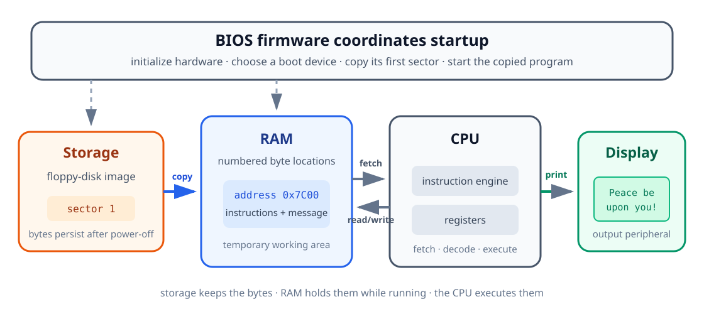
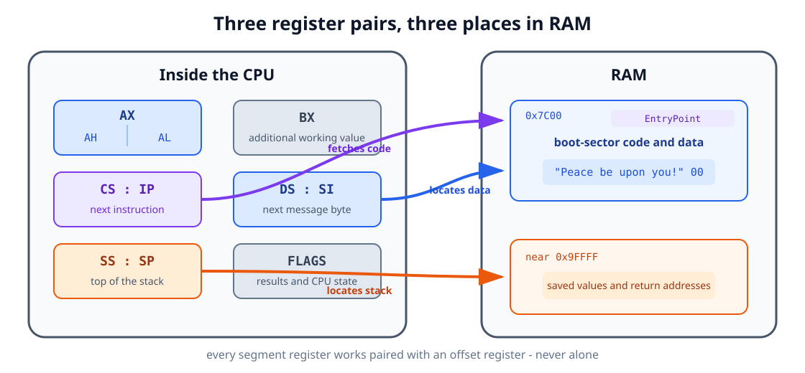
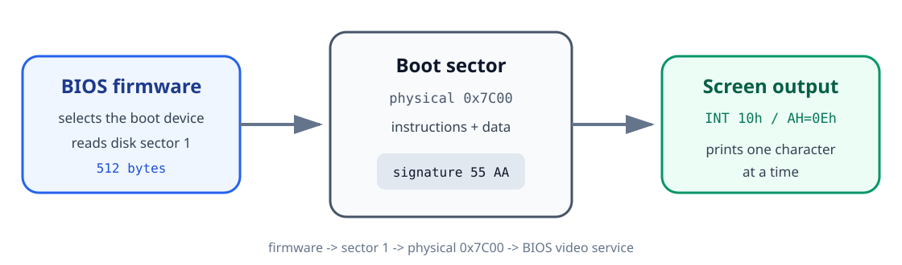

<div class="lesson-meta">

<div class="lesson-meta__eyebrow">AOS TUTORIALS · LESSON 00</div>

<p class="lesson-meta__summary"><strong>From CPU, memory, and registers to your first bootable program</strong></p>

<p class="lesson-meta__topics">
  <kbd>PC architecture</kbd>
  <kbd>x86 basics</kbd>
  <kbd>NASM</kbd>
  <kbd>BIOS</kbd>
</p>

</div>

## Before we begin

This lesson assumes that you have **no previous system-programming or assembly
knowledge**. If you can open a terminal and edit a text file, you already have
everything you need.

Most programming happens comfortably on top of an operating system, which
quietly handles the messy details of hardware for you. Here, we are going
underneath all of that - to the handful of ideas an operating system itself is
built from. It is a different kind of programming: slower to start, closer to
the metal, and - once the first message appears on screen - surprisingly
satisfying.

We will start with the physical pieces inside a PC and work, one small idea at
a time, toward a program that starts up with no Windows, no Linux, and no
operating system of any kind underneath it - just the CPU, memory, and a
handful of instructions you wrote yourself.

By the end, you will understand:

- The different jobs of the CPU, memory, storage, firmware, and peripherals.
- How a CPU sees instructions, data, memory addresses, and registers.
- Why assembly source code must be translated into machine code.
- How the stack, labels, loops, and subroutines work.
- How the BIOS finds and starts a 512-byte boot sector.

You will also produce:

| Artifact | Size | Purpose |
|---|---:|---|
| `boot.bin` | 512 bytes | Bootable machine code and the BIOS boot signature |
| `lesson-00.img` | 1,474,560 bytes | A floppy-disk image containing `boot.bin` |
| Screen output | One line | `Peace be upon you!` |

:::note[Take your time]

The program is short, but every line interacts directly with the machine.
Nothing here is padding for its own sake - understanding *why* each line is
necessary matters far more than memorizing what it does. If a section asks
you to slow down, it's because that is usually where the real
understanding lives.

:::

## 1. The main parts of a PC

An application normally sits on top of an operating system. The operating
system handles the hardware, so the application rarely needs to know how the
machine starts or how a character reaches the screen.

We are going below that layer, down to the five parts that make it all
possible:

### CPU

The **central processing unit**, or CPU, executes instructions - and only
instructions. It doesn't understand your code's intent, only bytes whose bit
patterns tell it to copy a number, compare two values, read a byte from
memory, or jump to another part of a program.

Left to itself, the CPU just repeats one simple cycle, forever:

1. Fetch the next instruction from memory.
2. Decode what the instruction means.
3. Execute it.
4. Continue with the next instruction, unless the current instruction says to
   jump.

Everything a computer ever does - a boot sector printing one line, or an
operating system running a thousand programs at once - is this same four-step
cycle, running billions of times per second. The CPU can execute only
**machine code**: bytes whose bit patterns represent instructions. It cannot
directly execute a NASM source file, no matter how carefully you write it.

### Memory (RAM)

**RAM** is the machine's temporary working area - closer to a desk you spread
papers out on than a place you store them long-term. Programs must be copied
into RAM before the CPU can execute them, and everything on that desk is
cleared the moment power is removed.

Memory is a long sequence of numbered byte-sized locations. The number of a
location is its **address**. If a byte is stored at address `0x7C00`, the CPU
can use that address to find it again - the same way a house number lets a
letter carrier find one specific house on a very long street.

### Storage

A floppy disk, hard disk, or solid-state drive provides persistent
**storage** - the filing cabinet to RAM's desk. Its contents remain after the
machine is turned off, which is exactly why our program has to start there
before it can run anywhere.

Storage and RAM are not interchangeable:

| Storage | RAM |
|---|---|
| Keeps files and disk sectors persistently | Holds the program and data currently in use |
| Read through a storage controller or firmware service | Read directly by the CPU |
| Usually much larger but slower | Usually smaller but faster |

At startup, our code is on storage. Before it can run, something must copy it
into RAM - and figuring out what that "something" is turns out to be the whole
point of this lesson.

### Firmware (BIOS)

The **BIOS** is firmware supplied with a traditional PC - the first thing
awake in the building, so to speak. It is the first software that runs after
power-on: it initializes hardware, chooses a boot device, and loads the first
piece of our program into that desk we just described.

The BIOS also provides small routines for tasks such as reading a disk sector
or printing a character - conveniences it's happy to lend out before anything
else exists to do the job. Our first program will ask one of those routines to
display text on our behalf.

### Peripherals

The display, keyboard, disk drive, and similar devices are **peripherals**.
The CPU never touches them directly; it always goes through a controller
built for that specific piece of hardware. In this lesson we let the BIOS
deal with the display controller so we don't have to yet.



The important path, the one this whole lesson is really about, is:

```text
disk storage → BIOS copies bytes → RAM → CPU executes bytes → screen output
```

## 2. Bits, bytes, and hexadecimal

Computers store information with two states, written as `0` and `1`. One such
state is a **bit**. Eight bits make one **byte**.

A byte can hold 256 different bit patterns, from `00000000` through
`11111111`. Writing long binary values by hand gets tedious and error-prone
fast, so system programmers commonly use **hexadecimal**, a base-16 number
system that packs the same information into far fewer digits.

Hexadecimal uses the digits `0-9` followed by `A-F`:

| Decimal | Hexadecimal | Binary |
|---:|---:|---:|
| 0 | `0x00` | `00000000` |
| 10 | `0x0A` | `00001010` |
| 15 | `0x0F` | `00001111` |
| 16 | `0x10` | `00010000` |
| 255 | `0xFF` | `11111111` |

The prefix `0x` tells the reader that a number is hexadecimal. NASM also
accepts an `h` suffix, but this tutorial consistently uses the `0x` form.

Two terms appear frequently in x86 documentation, and you'll see them constantly
from here on:

- A **byte** is 8 bits.
- A **word** is 16 bits, or 2 bytes.

Hexadecimal does not change the stored value, only how it looks on the page.
`255`, `0xFF`, and `11111111` are three different spellings of the exact same
number - pick whichever is easiest to read in context.

## 3. Memory and addresses

Imagine RAM as a very long row of numbered boxes, side by side, each one
holding exactly one byte:

```text
Address       0x7C00  0x7C01  0x7C02  0x7C03  ...
Stored byte      FA      B8      C0      07    ...
```

The addresses identify **where** the bytes are. The values in the boxes are
the actual instructions or data - the address tells you nothing about what's
inside the box until you know how the program intends to use it.

The same bytes can mean entirely different things depending on how a program
uses them:

- A CPU instruction.
- A number.
- A letter encoded as text.
- Part of a memory address.

For example, the letter `A` is represented by the value `0x41` in ASCII, a
common text encoding. Our message will be stored as a sequence of such byte
values followed by a zero byte - a detail that matters a great deal once we
get to Step 3 below.

### The address of our boot sector

The BIOS copies the first disk sector to memory beginning at physical address
`0x7C00`. If our sector contains 512 bytes, they occupy addresses `0x7C00`
through `0x7DFF` - a fixed, well-known spot the BIOS has used for this purpose
since the earliest PCs.

The CPU needs a reliable way to refer to code and data in that region. Early
x86 addressing uses a **segment** and an **offset**:

```text
physical address = segment × 16 + offset
```

For our program:

```text
0x07C0 × 0x10 + 0x0000 = 0x7C00
```

You do not need to explore every x86 addressing scheme yet - that story
continues in [Lesson 02](../02-entering-protected-mode/). For now,
remember only that we will use segment `0x07C0` as the base of the loaded boot
sector, and labels inside it will be offsets measured from that base.

## 4. Registers: the CPU's immediate workspace

Reading RAM is fast, but the CPU keeps an even smaller workspace right inside
itself: **registers**. If RAM is the desk, registers are more like the CPU's
own two hands - the handful of values it can act on instantly, without
reaching anywhere else.

Unlike variables in a high-level language, x86 registers have fixed names and
special conventional uses that you'll simply come to recognize with practice.

### The 8086 register file

The 8086 actually offers more registers than any single program is likely to
need. Seeing the whole family at once - general-purpose, pointer/index,
segment, and special-purpose - makes it easier to place the few we actually
use in their proper context, instead of meeting them as an unexplained list of
two-letter names.


This lesson only touches a handful of these - the highlighted ones above. The
rest, like `CX`/`DX` for counting and `DI`/`BP` for more advanced addressing,
will earn their place in later lessons. There's no need to memorize the full
table now; just know it's there so nothing you meet later feels unfamiliar.

### Registers used in this lesson

| Register | Role in our program |
|---|---|
| `AX` | General working register and BIOS function selection |
| `AH` / `AL` | Upper and lower 8-bit halves of `AX` |
| `BX` | Supplies display page and color values to the BIOS |
| `SI` | Holds the offset of the next message character |
| `DS` | Holds the base segment for our data |
| `ES` | A second data segment, initialized now for predictable later use |
| `SS` | Holds the base segment of the stack |
| `SP` | Holds the offset of the top of the stack |
| `IP` | Points to the next instruction; the CPU updates it automatically |

`AX` is a 16-bit register, but its two halves can also be addressed
separately, like a drawer you can open all the way or open just the front
half of:

```text
AX
┌───────────────┬───────────────┐
│ AH: high byte │ AL: low byte  │
└───────────────┴───────────────┘
```

This is why one BIOS call can use `AH` to select an operation while using `AL`
for the character involved in that same operation - two independent pieces of
information riding in one register.

### Segment:offset pairs

Section 3 introduced the formula `physical address = segment × 16 + offset`,
but glossed over one detail: which registers actually supply those two
halves. The answer is that a segment register never works alone - each one is
conventionally paired with a specific offset register, and together the pair
names one exact byte in RAM:

| Pair | Points at |
|---|---|
| `CS:IP` | The next instruction the CPU is about to fetch |
| `DS:SI` | The next byte of the message we are printing |
| `SS:SP` | The current top of the stack |

You never set `CS:IP` directly - the CPU updates it automatically as
instructions run, and `CALL`, `JMP`, and `RET` are the only ways to redirect
it. `DS` and `SS`, on the other hand, are ours to initialize explicitly, which
is exactly what Step 2 in Section 8 does before the program touches any data
or the stack.



### Flags

The CPU also maintains individual state bits called **flags**, a kind of
running scoreboard of "what just happened." An instruction such as `TEST`
updates flags to describe its result. A following instruction such as `JZ` can
then jump based on that scoreboard - here, specifically, when the result was
zero.

Our loop uses this pair to detect the zero byte at the end of the message,
which is how the program knows when to stop printing.

### The stack

The **stack** is an area of RAM used in last-in, first-out order - picture a
stack of plates: the last one you set down is the first one you pick back up.

```text
push AX  → save AX on top of the stack
push BX  → save BX above it
pop BX   → restore the most recently saved value
pop AX   → restore the value saved before that
```

`SS` and `SP` locate the top of that stack of plates, and it grows toward
lower addresses as things get pushed onto it. It's used for temporary values
and for return addresses whenever one part of a program calls another.

## 5. From assembly source to machine code

Machine code is difficult for humans to read and write directly - it's just
raw bytes. **Assembly language** exists to give those bytes names a human can
actually hold in their head.

For example:

```asm
mov ax, 0x07C0
```

This asks the CPU to copy the value `0x07C0` into register `AX`.

An **assembler** translates each readable instruction into the machine code
bytes it stands for. We use NASM:

```text
boot.s  ──NASM──>  boot.bin
source text          machine-code bytes
```

Assembly source contains several kinds of line, and it helps to be able to
name each one on sight:

| Kind | Example | Meaning |
|---|---|---|
| Instruction | `mov ds, ax` | An operation the CPU will execute |
| Label | `ShowMsg:` | A name for a location in the program |
| Directive | `[BITS 16]` | Information for NASM, not a CPU instruction |
| Data definition | `db "Hello", 0` | Bytes to include in the output file |
| Comment | `; initialize the stack` | Explanation ignored by NASM |

### A few instructions before we use them

| Instruction | Plain-language meaning |
|---|---|
| `mov destination, source` | Copy a value |
| `call label` | Run a subroutine and remember where to return |
| `ret` | Return to the instruction after `call` |
| `jmp label` | Continue at another label |
| `push register` | Save a register value on the stack |
| `pop register` | Restore a value from the stack |
| `int number` | Request a software service; here, a BIOS routine |
| `hlt` | Stop executing instructions until the CPU is awakened |

:::caution[Important]

In NASM syntax the destination comes first. `mov ax, 5` copies `5` into
`AX`; it does not copy `AX` into the number `5`. Getting this backwards is
one of the most common first mistakes - if a program misbehaves, it's
worth double-checking the order on every `mov`.

:::

## 6. How the BIOS starts our program

After the PC is powered on, the BIOS:

1. Initializes enough hardware to begin booting.
2. Chooses a boot device.
3. Reads that device's first 512-byte sector into memory at `0x7C00`.
4. Checks for a recognizable signature in the final two bytes.
5. Tells the CPU to begin executing the copied instructions.



That first sector is called the **boot sector**, and it lives by different
rules than the programs you may be used to: there is no operating system to
load it, no executable header, and no runtime library standing behind it. The
sector contains nothing but the bytes the BIOS and CPU actually need - not one
more.

The BIOS also leaves the number of the selected boot drive in register `DL`.
We will save and use it in [Lesson 01](../01-loading-the-kernel/).
This first program does not read more data from disk, so it does not need
that number yet - but it's worth remembering it's already sitting there,
waiting.

## 7. Anatomy of a boot sector

A BIOS boot sector is exactly 512 bytes - not one byte more, as we'll see
later, and the BIOS is strict about this.


| Region | Contents |
|---|---|
| Bytes `0-509` | Instructions, strings, and padding |
| Byte `510` | Signature byte `0x55` |
| Byte `511` | Signature byte `0xAA` |

NASM writes the signature with:

```asm
dw 0xAA55
```

`DW` means **define word**, so NASM emits a 2-byte value. x86 stores the lower
byte first, which turns the word `0xAA55` into the disk bytes `55 AA` - the
exact pattern the BIOS scans for before it trusts a sector enough to run it.

The instruction below inserts exactly enough zero bytes to place the
signature at offset 510, however much code comes before it:

```asm
times 510 - ($ - $$) db 0
```

The symbols have special meanings to NASM:

- `$` is the current position.
- `$$` is the beginning of the current section.
- `$ - $$` is therefore the number of bytes emitted so far.
- `DB 0` means emit one zero byte.

If the program grows beyond the available 510 bytes, NASM reports an error
instead of silently creating an invalid sector - a small mercy, since a
silently truncated boot sector would be a much harder bug to track down.

## 8. Building the program one idea at a time

We now have every piece we need. Let's build the program without treating a
single line as magic.

### Step 1: tell NASM what we are producing

```asm
[BITS 16]
[ORG 0]
```

`BITS 16` tells NASM which instruction encoding the CPU expects at startup.

`ORG 0` tells NASM to calculate labels as offsets beginning at zero. We will
place `0x07C0` in `DS`, so `DS` supplies the base address `0x7C00` and each
label supplies an offset within the loaded sector.

### Step 2: initialize the data registers and stack

The BIOS handed control to our code, but it makes no promises about what the
data and stack registers happen to contain at that moment - so the first job
is to stop assuming and start setting things explicitly.

```asm
EntryPoint:
    cli

    mov ax, 0x07C0
    mov ds, ax
    mov es, ax

    mov ax, 0x9000
    mov ss, ax
    mov sp, 0xFFFF

    cld
    sti
```

Line by line:

| Code | Meaning |
|---|---|
| `cli` | Temporarily prevent ordinary hardware events from interrupting stack setup |
| `mov ax, 0x07C0` | Put the boot-sector base segment in a general register |
| `mov ds, ax` | Make data labels refer to the loaded boot sector |
| `mov es, ax` | Initialize the second data segment to the same base |
| `mov ax, 0x9000` | Choose a separate region for the stack |
| `mov ss, ax` | Set the stack's base segment |
| `mov sp, 0xFFFF` | Set its starting top offset |
| `cld` | Make string-reading instructions advance toward higher addresses |
| `sti` | Allow maskable hardware interrupts again |

x86 does not allow a constant to be copied directly into a segment register,
so the value has to travel through `AX` first: `mov ax, 0x07C0`, then
`mov ds, ax`. It's an extra line, but not an optional one.

The `CLI`/`STI` pair is safe initialization boilerplate for now - it creates a
short quiet period while the stack changes, so nothing can interrupt us
mid-setup. Interrupt handling in general gets its own lesson later; for now,
treat this pair as a seatbelt you buckle without needing to know how the car
works.

### Step 3: store the message

```asm
bootMsg db "Peace be upon you!", 13, 10, 0
```

`DB` means **define bytes**. NASM converts the quoted characters to their
text byte values, then appends:

- `13`: carriage return, moving the cursor to the start of the line.
- `10`: line feed, moving the cursor down one line.
- `0`: a terminator that marks the end of the string.

The zero is never displayed. It's purely an end marker, a signpost our loop
will learn to recognize in Step 5.

### Step 4: point to the first character

```asm
mov si, bootMsg
call ShowMsg
```

`bootMsg` is a label. NASM quietly replaces it with the offset where those
message bytes actually ended up - you never have to compute that address by
hand.

Together, `DS:SI` identifies the next message byte:

- `DS` supplies the boot sector's base.
- `SI` supplies the offset of the current character.

`CALL` begins the `ShowMsg` subroutine. It also saves a return address on the
stack behind the scenes, which is exactly what lets `RET` find its way back to
resume at the instruction after the call.

### Step 5: read the message one byte at a time

Assembly has no built-in string object that remembers its own length - that
convenience simply doesn't exist yet at this level. Our "string" is nothing
more than a sequence of character bytes sitting next to one another in
memory, and `bootMsg` names the address of the very first one.

Here is a shorter example to see the shape clearly:

```asm
message db "Hi", 0
```

NASM stores it as:

| Offset from `message` | Stored byte | Meaning |
|---:|---:|---|
| `0` | `0x48` | `H` |
| `1` | `0x69` | `i` |
| `2` | `0x00` | End of the string |

This convention is called a **null-terminated string**. "Null" means the zero
byte `0x00`. It is never displayed as a character; it exists purely to tell
the reading loop where to stop. Without that final zero, the loop would keep
marching forward into whatever bytes happen to sit next in memory - almost
certainly not text, and almost certainly not what you want on screen.

Our complete message works the same way:

```asm
bootMsg db "Peace be upon you!", 13, 10, 0
```

It contains the text bytes, the carriage-return and line-feed bytes, and
finally the zero terminator that closes it off.

```asm
ShowMsg:
    push ax
    push bx
    push si

.loop:
    lodsb
    test al, al
    jz .done

    mov ah, 0x0E
    mov bx, 0x0007
    int 0x10
    jmp .loop

.done:
    pop si
    pop bx
    pop ax
    ret
```

The routine first saves the registers it is about to change, then restores
them in reverse order right before returning - good manners for any
subroutine that borrows registers it doesn't own.

On each pass, `LODSB` places the next byte in `AL`. `TEST AL, AL` compares
that value against itself; the result can only be zero when `AL` itself is
zero, and the CPU records that in its zero flag. If `AL` holds the null
terminator, `JZ .done` reads that flag, takes the jump, and the routine is
done. Otherwise, the byte is an ordinary character and the BIOS displays it.

The loop works like this:

| Instruction | Effect |
|---|---|
| `lodsb` | Load the byte at `DS:SI` into `AL`, then advance `SI` |
| `test al, al` | Check whether that byte is zero |
| `jz .done` | Leave the loop when the terminator is reached |
| `mov ah, 0x0E` | Select the BIOS teletype-output service |
| `mov bx, 0x0007` | Select display page 0 and a standard text color |
| `int 0x10` | Ask the BIOS to display the character in `AL` |
| `jmp .loop` | Repeat for the next byte |

The BIOS call itself works like a tiny paper request form, filled out one
register at a time:

| Register | Request field |
|---|---|
| `AH = 0x0E` | Operation: print one character |
| `AL` | Character to print |
| `BH = 0` | Display page |
| `BL = 7` | Foreground color when relevant |

### Step 6: stop after returning

```asm
.hang:
    cli
    hlt
    jmp .hang
```

There is no operating system to return control to, and no next application
waiting to launch - once our message is printed, there is genuinely nothing
left to do. The program disables ordinary hardware interrupts and halts, and
the backward jump makes sure that even if the CPU is ever woken back up, it
loops right back into this same quiet stop instead of wandering off into
whatever padding bytes come next.

## 9. Complete boot-sector source

The ideas above form the complete `lesson 00/src/boot.s` program - every line
below should now read as something you've already met, not something new.

```asm
; AOS Lesson 00 - Writing your first boot sector

[BITS 16]
[ORG 0]

EntryPoint:
    ; Establish known data segments and a safe stack.
    cli

    mov ax, 0x07C0
    mov ds, ax
    mov es, ax

    mov ax, 0x9000
    mov ss, ax
    mov sp, 0xFFFF

    cld
    sti

    mov si, bootMsg
    call ShowMsg

.hang:
    cli
    hlt
    jmp .hang

; Print the zero-terminated string at DS:SI with BIOS teletype output.
ShowMsg:
    push ax
    push bx
    push si

.loop:
    lodsb
    test al, al
    jz .done

    mov ah, 0x0E
    mov bx, 0x0007
    int 0x10
    jmp .loop

.done:
    pop si
    pop bx
    pop ax
    ret

bootMsg db "Peace be upon you!", 13, 10, 0

times 510 - ($ - $$) db 0
dw 0xAA55
```

The same source is available in the repository:
[lesson 00/src/boot.s](https://github.com/yelouafi/aos/blob/main/lesson%2000/src/boot.s).

### Trace the whole execution

Before assembling it, it's worth walking the program once, start to finish,
purely in your head:

1. The BIOS copies the sector from disk to memory at `0x7C00`.
2. The CPU begins at `EntryPoint`.
3. The program initializes its data registers and stack.
4. `SI` receives the offset of `bootMsg`.
5. `CALL` saves a return address and enters `ShowMsg`.
6. `LODSB` reads one character into `AL`.
7. If the character is not zero, `INT 10h` displays it.
8. The loop repeats until the zero terminator is found.
9. `RET` uses the saved return address to leave `ShowMsg`.
10. The program enters its halt loop.

If that trace makes sense end to end, you already understand this program
better than the syntax alone would suggest.

## 10. Assemble and inspect the sector

NASM's `bin` output format writes the assembled bytes directly, with no
application header or extra metadata wrapped around them - what you see is
genuinely everything that ends up on disk.

```sh
mkdir -p "lesson 00/build"
nasm -f bin "lesson 00/src/boot.s" -o "lesson 00/build/boot.bin"
```

The quotation marks are necessary because the directory name contains a
space.

Confirm that the output is exactly 512 bytes:

```sh
wc -c "lesson 00/build/boot.bin"
```

Inspect the final two bytes:

```sh
od -An -tx1 -j 510 -N 2 "lesson 00/build/boot.bin"
```

Expected signature:

```text
55 aa
```

The included Makefile performs the same build and checks in one step:

```sh
make -C "lesson 00"
make -C "lesson 00" inspect
```

Expected output:

```text
size: 512 bytes
signature: 55 aa
```

## 11. Create and run a floppy image

A disk image is a file containing the bytes of an entire disk. Create a
standard 1.44 MiB floppy image and put the boot sector in its first 512
bytes:

```sh
make -C "lesson 00" image
```

The result is:

```text
lesson 00/build/lesson-00.img
```

### Run it in your browser

This is the exact floppy image produced by the lesson's source and Makefile,
booted in an x86 PC emulator inside this page. The emulator only starts when
you ask it to, and everything runs locally in your browser.

<div class="aos-playground" data-v86-playground="lesson-00">
  <div class="aos-playground__header">
    <div>
      <span class="aos-playground__eyebrow">AOS browser lab</span>
      <h4 class="aos-playground__title">Lesson 00 · Boot sector</h4>
      <p class="aos-playground__description">SeaBIOS will boot <code>lesson-00.img</code> as a 1.44 MiB floppy disk.</p>
    </div>
    <div class="aos-playground__status" data-v86-status data-state="idle" role="status" aria-live="polite">
      <span class="aos-playground__status-dot" aria-hidden="true"></span>
      <span data-v86-status-text>Ready to start</span>
    </div>
  </div>

  <div class="aos-playground__controls" aria-label="Emulator controls">
    <button class="aos-playground__button aos-playground__button--primary" type="button" data-v86-action="start">
      Start emulator
    </button>
    <button class="aos-playground__button" type="button" data-v86-action="pause" disabled>
      Pause
    </button>
    <button class="aos-playground__button" type="button" data-v86-action="reset" disabled>
      Reset
    </button>
  </div>

  <div class="aos-playground__display">
    <div class="aos-playground__placeholder" data-v86-placeholder>
      <strong>PC powered off</strong>
      <span>Press Start emulator to boot the lesson image.</span>
    </div>
    <div class="aos-playground__screen" data-v86-screen aria-label="Emulated PC display">
      <div class="aos-playground__text-screen"></div>
      <canvas class="aos-playground__canvas"></canvas>
    </div>
  </div>

  <div class="aos-playground__footer">
    <span>The first start downloads the emulator runtime, BIOS, and floppy image.</span>
    <details class="aos-playground__error" data-v86-error hidden>
      <summary>Technical details</summary>
      <pre data-v86-error-text></pre>
    </details>
  </div>
</div>

If `qemu-system-i386` is installed, start the virtual PC with:

```sh
make -C "lesson 00" run
```

The Makefile uses:

```sh
qemu-system-i386 \
  -drive file=build/lesson-00.img,format=raw,if=floppy \
  -boot order=a
```

QEMU should open a display containing:

```text
Peace be upon you!
```

If that line appears, take a moment with it: a machine just started up with
no operating system at all, ran instructions you wrote yourself, and did
exactly what you told it to. Everything from here builds on that same
foundation.

### Troubleshooting

| Symptom | Check |
|---|---|
| NASM is not found. | Install NASM and confirm that `nasm -v` works in your terminal. |
| The BIOS reports no bootable device. | Confirm that the file is 512 bytes and ends in `55 aa`. |
| The emulator prints nothing. | Confirm `DS = 0x07C0`, `SI = bootMsg`, and `AH = 0x0E`. |
| NASM reports a negative `TIMES` value. | The code and data exceed the 510 bytes available before the signature. |
| QEMU treats the image as a hard disk. | Keep `format=raw,if=floppy` in the `-drive` option. |

## 12. What you have learned

You began with the basic parts of a PC and followed a program through every
layer between them:

```text
assembly source
      ↓ NASM
machine-code bytes
      ↓ written to sector 1
floppy image
      ↓ BIOS copies it
RAM at 0x7C00
      ↓ CPU executes it
message on the screen
```

The boot sector can now execute instructions, find data in memory, use a
stack, call a subroutine, loop over a string, and communicate with the
screen. None of that was given to you by an operating system - you built it,
line by line, on bare hardware.

[Lesson 01 - Loading the Kernel from a Floppy Disk](../01-loading-the-kernel/)
builds on those foundations. It uses a BIOS disk service to copy a second
program from storage into memory, then transfers control to that program -
the first step toward a kernel that no longer fits in 512 bytes.
</content>
