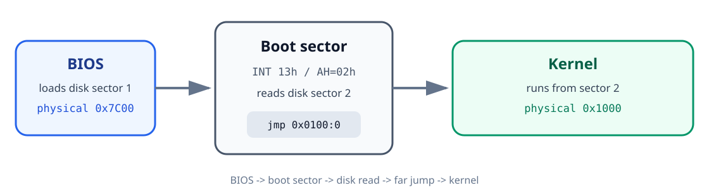
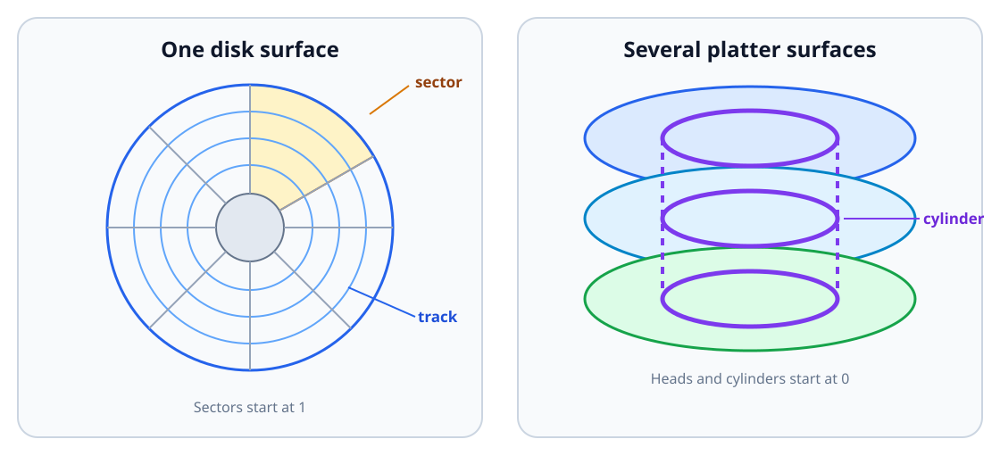

<div class="lesson-meta">

<div class="lesson-meta__eyebrow">AOS TUTORIALS · LESSON 01</div>

<p class="lesson-meta__summary"><strong>Read a second program from disk, then hand it the machine</strong></p>

<p class="lesson-meta__topics">
  <kbd>16-bit x86</kbd>
  <kbd>BIOS</kbd>
  <kbd>NASM</kbd>
  <kbd>Real mode</kbd>
</p>

</div>

## What you will build

By the end of the lesson, you will have two 512-byte programs working
together instead of one working alone:

| Disk sector | Program | Loaded at | Responsibility |
|---:|---|---:|---|
| 1 | Boot sector | `0x07C0:0x0000` (physical `0x7C00`) | Ask the BIOS to read the kernel |
| 2 | Kernel | `0x0100:0x0000` (physical `0x1000`) | Print a message to the screen |

This lesson continues
[Lesson 00 - Writing Your First Boot Sector](../00-writing-a-boot-sector/),
which stopped right after printing a message from a boot sector and then
halting - a real result, but a dead end. Every boot sector is capped at 512
bytes, and a real operating system needs far more room than that. So here we
take the next natural step: use those precious 512 bytes not to *do* the
work, but to go fetch a second program that can.

Lesson 00 introduced the PC's components, memory addresses, registers, the
stack, assembly syntax, and the BIOS boot process that all of this rests on.
Keep it nearby if any of those ideas still feel new - this lesson leans on
every one of them.



## 1. Starting point

The previous lesson produced a boot sector that displayed a line of text with
BIOS video service `INT 10h`, function `AH = 0Eh`, then stopped forever. It
worked, but it never left its own 512 bytes.

<details markdown="1">
<summary><strong>Show the previous lesson's boot-sector program</strong></summary>

```asm
[BITS 16]
[ORG 0]

EntryPoint:
    cli

    mov ax, 0x07C0
    mov ds, ax
    mov es, ax

    mov ax, 0x9000
    mov ss, ax
    mov sp, 0xFFFF

    cld
    sti

    mov si, bootMsg
    call ShowMsg

.hang:
    cli
    hlt
    jmp .hang

ShowMsg:
    push ax
    push bx
    push si

.loop:
    lodsb
    test al, al
    jz .done

    mov ah, 0x0E
    mov bx, 0x0007
    int 0x10
    jmp .loop

.done:
    pop si
    pop bx
    pop ax
    ret

bootMsg db "Peace be upon you!", 13, 10, 0

times 510 - ($ - $$) db 0
dw 0xAA55
```

</details>

We will extend that program in two stages:

1. Use BIOS disk service `INT 13h` to load the kernel.
2. Write a tiny kernel that prints a second message.

## 2. How a disk is organized

Inside a floppy's plastic shell is a flexible disk coated with magnetic
material, similar in principle to magnetic tape. The drive encodes stored
data as magnetic patterns and decodes those patterns back into binary data
when reading - a floppy disk is really just a very small, very slow hard
drive wearing a different costume.

The drive itself contains:

- A motor that spins the disk at a fixed speed.
- Two read/write heads, one for each side of the floppy.
- A mechanical arm that moves the heads between the outer edge and the
  center.

Each disk surface is divided into concentric **tracks**, the way a vinyl
record has grooves circling its surface. Each track is further divided into
**sectors**, and every sector on a standard floppy holds the same amount of
data. For this lesson, one sector is **512 bytes** - the same size, not
coincidentally, as our boot sector.

Hard disks follow the same general idea, but use rigid platters that can spin
much faster. A hard disk normally stacks several platter surfaces on top of
one another, like a tower of vinyl records sharing a single spindle. Tracks
sitting at the same radius on every surface, stacked directly above each
other, form a **cylinder**.



### CHS addressing

The BIOS interface used in this lesson identifies a sector with three values:

1. **Cylinder** - the track position from the outer edge toward the center.
2. **Head** - the selected disk surface.
3. **Sector** - the selected sector within that track.

This scheme is called **CHS**, for cylinder-head-sector - three coordinates
that together pin down one exact 512-byte block on the disk, the same way a
row, column, and aisle number pin down one shelf in a warehouse.

Data is ordered first by sector, then by head, then by cylinder. On a floppy,
the sequence begins with sector 1 on head 0 of cylinder 0. After the last
sector on that track, it continues on head 1 of the same cylinder, then moves
to cylinder 1.

:::caution[Important]

Sector numbers begin at **1**. Cylinder and head numbers begin at **0**.
This asymmetry trips up almost everyone the first time - there is no
"sector 0."

:::

## 3. Reading sectors with BIOS INT 13h

In real mode, BIOS interrupt `INT 13h` provides disk services, the disk
equivalent of the `INT 10h` video service from Lesson 00. Function `AH = 02h`
reads one or more sectors using CHS addressing.

Like any BIOS call, it works as a small request form filled out in
registers before you hand it to `INT 13h`:

### Inputs

| Register | Meaning in this lesson |
|---|---|
| `ES:BX` | Destination buffer in memory. `ES` is the segment and `BX` is the offset. |
| `AH` | Function number: `02h` means "read sectors." |
| `AL` | Number of sectors to read. |
| `CH` | Low eight bits of the cylinder number. We use cylinder `0`. |
| `CL` | Sector number in bits 0-5; the top two cylinder bits are stored in bits 6-7. We use sector `2`. |
| `DH` | Head number. We use head `0`. |
| `DL` | BIOS drive number. Preserve the value supplied by the BIOS instead of assuming drive `0`. |

### Outputs

| Carry flag | Result |
|---|---|
| `CF = 0` | The read succeeded and the requested data is in memory. |
| `CF = 1` | The read failed; `AH` contains a BIOS status code. |

Unlike the video service, this one can fail - a floppy drive is a mechanical
thing, and mechanical things jam. The carry flag is how the BIOS reports
that back to us, and checking it after every `INT 13h` call is not optional
caution; it is the only way to notice a bad read before jumping into
whatever garbage happened to land in memory.

At this point the disk layout is simple - two sectors, back to back:

```text
+----------------------+----------------------+
| Sector 1             | Sector 2             |
| boot.bin (512 bytes) | kernel.bin (512 B)   |
+----------------------+----------------------+
```

The boot sector asks the BIOS to copy sector 2 into `ES:BX = 0x0100:0x0000`.

<table>
  <tr>
    <td><strong>Real-mode address rule</strong></td>
    <td><code>physical address = segment * 16 + offset</code></td>
  </tr>
  <tr>
    <td><strong>Kernel destination</strong></td>
    <td><code>0x0100 * 0x10 + 0x0000 = 0x1000</code></td>
  </tr>
</table>

## 4. Writing the boot sector

The BIOS places the boot drive number in `DL` the moment our code starts
running. Save it before performing any disk operation, but only **after**
initializing `DS` - the BIOS does not guarantee the initial value of `DS`,
and a `mov [bootdrv], dl` executed too early could quietly write to the wrong
place entirely.

The completed boot sector:

```asm
; boot.s
[BITS 16]
[ORG 0]

EntryPoint:
    ; Establish a known stack and string direction.
    cli
    mov ax, 0x9000
    mov ss, ax
    mov sp, 0xFFFF
    cld
    sti

    ; This source uses offsets relative to segment 0x07C0.
    mov ax, 0x07C0
    mov ds, ax
    mov es, ax

    ; The BIOS tells us which drive booted in DL.
    mov [bootdrv], dl

    mov si, bootMsg
    call ShowMsg

    ; Reset the boot drive before reading.
    mov dl, [bootdrv]
    xor ax, ax                    ; AH = 00h: reset disk system
    int 0x13
    jc readFail

    ; Read cylinder 0, head 0, sector 2 into 0x0100:0x0000.
    mov ax, 0x0100
    mov es, ax
    xor bx, bx
    mov ah, 0x02                 ; BIOS read-sector function
    mov al, 0x01                 ; read one sector
    mov ch, 0x00                 ; cylinder 0
    mov cl, 0x02                 ; sector 2
    mov dh, 0x00                 ; head 0
    mov dl, [bootdrv]
    int 0x13
    jc readFail

    ; CS:IP becomes 0x0100:0x0000, where the kernel was loaded.
    jmp 0x0100:0x0000

readFail:
    mov si, readError
    call ShowMsg

.hang:
    jmp .hang

ShowMsg:
    push ax
    push bx
    push si

.loop:
    lodsb
    test al, al
    jz .done
    mov ah, 0x0E                 ; BIOS teletype output
    mov bx, 0x0007               ; page 0, light-gray foreground
    int 0x10
    jmp .loop

.done:
    pop si
    pop bx
    pop ax
    ret

bootdrv  db 0
bootMsg  db "Peace be upon you!", 13, 10, 0
readError db "Error: unable to read the kernel.", 13, 10, 0

times 510 - ($ - $$) db 0
dw 0xAA55
```

The final word `0xAA55` is the boot signature, exactly as in Lesson 00.
Because x86 stores words in little-endian order, it appears on disk as bytes
`55 AA` at offsets 510 and 511.

### What the new code does

Everything above `mov si, bootMsg` should already look familiar from Lesson
00. Here is what got added on top of it:

| Code | Purpose |
|---|---|
| `mov [bootdrv], dl` | Preserve the drive selected by the BIOS. |
| `AH = 00h`, `INT 13h` | Reset the disk service for that drive. |
| `ES:BX = 0x0100:0` | Select physical destination `0x1000`. |
| `AH = 02h`, `AL = 1` | Read exactly one sector. |
| `CH = 0`, `CL = 2`, `DH = 0` | Select cylinder 0, sector 2, head 0. |
| `jc readFail` | Check the carry flag and report a disk error. |
| `jmp 0x0100:0` | Perform a 16:16 far jump to the loaded kernel. |

That last jump is the entire point of the lesson in one line: it is the exact
moment control leaves the boot sector's 512 bytes for good and hands the
machine to a second, independently loaded program.

## 5. Writing the kernel

The kernel begins at offset 0 within segment `0x0100`, so its source uses
`ORG 0`. It initializes the data segments and stack exactly the way the boot
sector did, prints a message with the same BIOS video service, and then stops
in an infinite loop - the same shape as Lesson 00's program, just now living
somewhere else in memory.

```asm
; kernel.s
[BITS 16]
[ORG 0]

start:
    cli

    ; The boot sector loaded this code at segment 0x0100.
    mov ax, 0x0100
    mov ds, ax
    mov es, ax

    mov ax, 0x9000
    mov ss, ax
    mov sp, 0xFFFF

    cld
    sti

    mov si, kernelMsg
    call ShowMsg

.hang:
    jmp .hang

ShowMsg:
    push ax
    push bx
    push si

.loop:
    lodsb
    test al, al
    jz .done
    mov ah, 0x0E
    mov bx, 0x0007
    int 0x10
    jmp .loop

.done:
    pop si
    pop bx
    pop ax
    ret

kernelMsg db "Kernel loaded.", 13, 10, 0

; The boot sector reads one complete 512-byte sector.
times 512 - ($ - $$) db 0
```

Notice that this "kernel" is really just another boot-sector-shaped program -
nothing about the format changes. What makes it a kernel in this lesson is
only its role: it is the thing the boot sector hands control to, not
anything intrinsically different about its bytes. Later lessons will start
asking much more of it.

Because both programs use `ShowMsg`, you can move it to a shared include
file:

```asm
%include "showmsg.inc"
```

For a first experiment, keeping the routine in both source files makes each
listing self-contained and easier to read start to finish without flipping
between files.

## 6. Assemble the programs

Use NASM's flat-binary output format:

```sh
nasm -f bin boot.s -o boot.bin
nasm -f bin kernel.s -o kernel.bin
```

Both files should be exactly 512 bytes:

```sh
wc -c boot.bin kernel.bin
```

Expected result:

```text
512 boot.bin
512 kernel.bin
```

Create a two-sector image:

```sh
cat boot.bin kernel.bin > aos.img
```

The resulting `aos.img` is 1,024 bytes. It contains the boot sector followed
immediately by the kernel sector and can be attached as a raw floppy image in
an x86 emulator such as Bochs.

### Run it in your browser

The playground uses the same two assembled sectors, padded to a standard
1.44 MiB floppy image. Reaching `Kernel loaded.` proves that the boot sector
read sector 2 and transferred control to the kernel.

<div
  data-aos-v86-playground
  lesson="lesson-01"
  title="Lesson 01 · Load the kernel"
  expected-output="Kernel loaded."
></div>

:::caution[Warning]

The next command writes directly to a device. Confirm the device name
before running it. Selecting the wrong target can destroy data.

:::

To write the image to floppy drive A on a Unix-like system:

```sh
dd if=aos.img of=/dev/fd0 bs=512 conv=fsync
```

### Windows

Create the same two-sector image with:

```bat
copy /b boot.bin+kernel.bin aos.img
```

They then use `ntrawrite` to copy the image to a physical floppy:

```bat
ntrawrite -f aos.img
```

When prompted for the diskette drive, enter `A`.

## 7. Result

The machine now follows this sequence:

1. The BIOS loads and runs the boot sector.
2. The boot sector prints `Peace be upon you!`.
3. BIOS disk service `INT 13h` copies sector 2 to physical address `0x1000`.
4. A far jump transfers control to `0x0100:0x0000`.
5. The kernel prints `Kernel loaded.` and remains in its infinite loop.

The kernel does very little on its own, but the boundary that mattered has
already been crossed: code is no longer limited to the 512 bytes the BIOS is
willing to load automatically. Anything the boot sector can read from disk,
it can now hand control to - a larger kernel, a different program, or, in the
next lesson, a completely different CPU mode.

[Lesson 02 - Entering 32-bit Protected Mode](../02-entering-protected-mode/)
builds the required descriptor table, changes the processor's operating
mode, and writes directly to VGA text memory from a 32-bit kernel.
</content>
