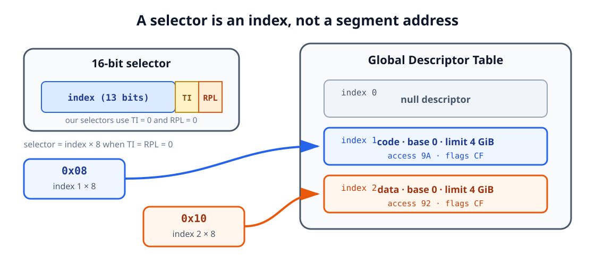

<div class="lesson-meta">

<div class="lesson-meta__eyebrow">AOS TUTORIALS · LESSON 02</div>

<p class="lesson-meta__summary"><strong>Give the CPU a new map of memory, then step into 32-bit code</strong></p>

<p class="lesson-meta__topics">
  <kbd>x86</kbd>
  <kbd>Protected mode</kbd>
  <kbd>GDT</kbd>
  <kbd>VGA text memory</kbd>
</p>

</div>

## What you will build

[Lesson 01](../01-loading-the-kernel/) ended with a boot sector that loaded
a second program from disk and jumped straight into it. That was real progress -
but both programs were still living in the CPU's cozy, BIOS-provided startup
world, asking `INT 10h` to print every character for us.

This lesson pulls that safety net away. By the end of it, the boot sector will
hand the CPU a completely different rulebook for how it sees memory, flip a
single bit that changes how every instruction afterward is interpreted, and land
in a kernel that talks to the screen hardware directly - no BIOS involved at all.

Concretely, the boot sector will:

1. Load a 32-bit kernel from sector 2.
2. Describe the memory layout with a **Global Descriptor Table**, or GDT.
3. Enable **protected mode** in control register `CR0`.
4. Reload the CPU's code and data segments.
5. Transfer control to the kernel at address `0x1000`.

The kernel will then clear the display and print:

```text
Protected mode is active.
```

It cannot use the old BIOS printing routine, so it will write characters directly
to VGA text memory. That is the payoff moment of this lesson: watching the exact
instant a machine stops being "a BIOS with a program attached" and becomes "a
program that owns the machine."

| Item | Location | Purpose |
|---|---:|---|
| Boot sector | `0x7C00` | Load the kernel and change CPU mode |
| Kernel | `0x1000` | Run 32-bit instructions |
| VGA text buffer | `0xB8000` | Hold screen characters and colors |
| GDT | Inside the boot sector | Describe the code and data address spaces |


If some of what follows feels dense on a first read, that is completely normal -
protected mode touches almost everything about how the CPU thinks about memory.
Section 9 retraces the whole transition step by step once every piece is in
place, so treat this first pass as building the vocabulary you will use there.

## 1. How the CPU reaches memory and devices

Lesson 00 introduced the CPU, RAM, storage, and peripherals as separate boxes on
a diagram. Before reshaping how the CPU sees memory, it helps to open up what
actually happens on the wires between those boxes.

Think of it as a small delivery system. Electronic paths called **buses**
connect the CPU to memory and hardware controllers, and a simplified PC carries
four kinds of signal over them:

| Signal group | Job |
|---|---|
| Address | Select a memory location or hardware port |
| Data | Carry the value being read or written |
| Control | Describe the operation, such as read or write |
| Power and timing | Supply energy and coordinate the transfer |

The address bus asks "which mailbox," the data bus carries "what's inside," and
the control bus decides whether we are dropping something off or picking
something up.

### Address width and address space

Every address bus has a fixed number of wires, so it can only spell out so many
distinct addresses. If the CPU has `n` usable address bits, it can form `2^n`
distinct addresses - one for every combination of those wires being high or low,
the same way an `n`-digit combination lock has `2^n` possible combinations.

| Address bits | Number of distinct byte addresses |
|---:|---:|
| 16 | `2^16 = 65,536` |
| 20 | `2^20 = 1,048,576` (1 MiB) |
| 32 | `2^32 = 4,294,967,296` (4 GiB) |

:::caution[Important]

An address space is the set of addresses the CPU **can express** - think of
it as the size of the mailbox directory, not how many mailboxes happen to be
full. It is not the amount of RAM physically installed in the computer.

:::

The original 8086 exposed 20 address lines, covering the first 1 MiB - the
entire directory it could ever address. BIOS-compatible startup still preserves
that old layout today, quirks and all, including the historical A20 boundary
behavior we will deliberately sidestep for now. Later, in the 32-bit flat layout
this lesson builds, code can use 32-bit offsets across a full 4 GiB linear
address space - 4,096 times larger than anything the 8086 could ever see.

### Data width

Address lines pick a location; data lines decide how much you can carry through
the door in one trip.

| Width | x86 name |
|---:|---|
| 8 bits | Byte |
| 16 bits | Word |
| 32 bits | Doubleword, or `dword` |

The CPU's general-purpose registers mirror this split: `AX` is a 16-bit
register, while `EAX` is its 32-bit extension - the same register wearing a
bigger handle.

### Little-endian byte order

Memory is addressed one byte at a time, so when x86 stores something wider than
a single byte, it has to decide which piece goes where. Its rule: put the
least-significant byte at the lowest address.

For the 16-bit value `0x1234`:

| Address | Stored byte |
|---:|---:|
| `n` | `0x34` |
| `n + 1` | `0x12` |

This is called **little-endian** order, and it can trip you up the first time
you inspect raw memory in a debugger and see bytes that look "backwards." They
are not backwards - the CPU always reads them in this same order, so
reconstructing `0x1234` from `34 12` is automatic once you know the rule.

### Three ways to communicate

Everything the CPU exchanges with the rest of the machine goes through one of
three doors:

1. **Memory access** - the CPU reads and writes addressed bytes in RAM.
2. **Input/output access** - the CPU communicates with a controller through a
   separate port number or through a memory-mapped region.
3. **Interrupts** - a device or CPU event asks the processor to pause its
   current sequence and handle an event.

Port numbers live in a completely separate I/O address space; they are not RAM
addresses, even when the numbers look the same. I/O port `0x3D0` and memory
address `0x3D0` are two unrelated things that happen to share some digits.

We will keep interrupts turned off for the entire mode switch in this lesson,
because the old BIOS interrupt table stops being valid partway through and we
have not built a protected-mode one yet.

## 2. From startup segmentation to protected mode

We deliberately avoided CPU-mode terminology in Lesson 00 so you could focus on
the basics first. Now that the boot sector and kernel already cooperate in real
mode, it is time to name what "real mode" actually means - and what changes when
we leave it.

### Real-mode addresses

The environment the BIOS starts our boot sector in is called **real mode** -
"real" as in close to the original 8086, not as in simple to reason about. An
address is formed from a 16-bit segment and a 16-bit offset:

```text
physical address = segment × 16 + offset
```

Because the segment gets multiplied by 16 before the offset is added in, many
different segment:offset pairs can name the exact same physical byte - similar
to how two different room-and-floor combinations can point at the very same
door if the numbering overlaps:

```text
0x3415:0x0055 → 0x34150 + 0x0055 → 0x341A5
0x341A:0x0005 → 0x341A0 + 0x0005 → 0x341A5
```

Our previous lessons leaned on exactly this arrangement:

```text
0x07C0:0x0000 → boot sector at physical 0x7C00
0x0100:0x0000 → kernel at physical 0x1000
```

This scheme is a direct descendant of the earliest x86 processors, and it is why
every address in our lessons so far has had a 16-bit segment:offset spelling.
Segment arithmetic can nominally reach slightly beyond 1 MiB on later CPUs;
whether those addresses actually wrap around depends on the A20 address line.
Everything in this lesson deliberately stays below that boundary, so it will not
matter yet.

### Protected-mode addresses

Protected mode throws out the "multiply and add" rule entirely, and this is
usually the point where the segment:offset mental model stops helping and
starts getting in the way. It is fine to let it go here.

In protected mode, a segment register no longer contains a segment base to
multiply by 16. It contains a **segment selector**:

```text
selector : 32-bit offset
```

Think of the selector less like an address and more like a catalog number:
punching it into the CPU does not hand back a memory location directly - it
points to a full description of that memory region, kept in a table. That
description, the **descriptor**, is what actually supplies the base address,
limit, type, and access rules, and the CPU checks those rules before it lets any
access through.

This layer of indirection is exactly what makes features like privilege levels
and per-region memory validation possible: the CPU can refuse a selector, or the
access that comes with it, before ever touching RAM.

:::note[A third historical mode]

The source lesson also mentions virtual-8086 mode, which lets software run
certain 8086-style programs underneath a protected-mode operating system.
You may see it referenced elsewhere in x86 material; feel free to file it
away and move on - this kernel never touches it.

:::

### The flat memory model

This lesson creates exactly one code descriptor and one data descriptor - the
bare minimum protected mode requires, set up so they get out of the way rather
than help. Both have:

- Base address `0`.
- Limit covering the entire 4 GiB linear address space.
- Privilege level `0`, the most privileged level.

Because their base is zero, whatever offset you write is already the
corresponding linear address. This is called a **flat memory model**:

```text
linear address = descriptor base 0 + offset
```

Segmentation still exists underneath, but from here on it no longer shifts
anything - every offset you write in code is the real address.


## 3. Selectors and the Global Descriptor Table

The **Global Descriptor Table**, or GDT, is where descriptors actually live: an
array of 8-byte entries in memory, one entry per segment we want to describe.
Ours needs exactly three:

| Index | Selector | Entry |
|---:|---:|---|
| 0 | `0x00` | Required null descriptor |
| 1 | `0x08` | 32-bit code segment |
| 2 | `0x10` | 32-bit data and stack segment |

Why does index 1 become selector `0x08` rather than a plain `0x01`? Because a
selector is not just a table index - its low three bits are reserved for flags,
and only the remaining bits hold the actual index:

```text
selector = index × 8
```

Therefore:

```text
1 × 8 = 0x08  → code descriptor
2 × 8 = 0x10  → data descriptor
```



### The null descriptor

Index 0 is required to be unusable - not by convention, but by rule. Its job is
to make selector zero mean "no segment, deliberately," instead of accidentally
selecting valid memory if a bug ever leaves a segment register at zero.

```asm
gdtNull:
    dq 0
```

`DQ` defines one 8-byte quantity, so this single line emits eight zero bytes -
the whole entry.

### What is inside a descriptor?

An x86 code or data descriptor packs a surprising amount of information into
just 64 bits:


The main fields are:

| Field | Purpose |
|---|---|
| Base | 32-bit starting linear address of the segment |
| Limit | 20-bit maximum offset inside the segment |
| Type | Code/data kind and allowed operations |
| `S` | `1` for a normal code or data descriptor |
| `DPL` | Privilege level, from 0 to 3 |
| `P` | Present bit; `1` means the descriptor is usable |
| `D/B` | `1` selects 32-bit code or stack behavior |
| `G` | Granularity: bytes when `0`, 4 KiB units when `1` |
| `AVL` | Bit available for software use |

The 20-bit limit field can only count up to `0xFFFFF` on its own. With `G = 1`,
though, the CPU reinterprets that count in 4 KiB units instead of bytes,
stretching it to cover every offset through `0xFFFFFFFF` - the full 4 GiB range,
out of an 8-byte structure designed long before flat addressing existed.

### Our code descriptor

```asm
gdtCode:
    dw 0xFFFF
    dw 0x0000
    db 0x00
    db 10011010b
    db 11001111b
    db 0x00
```

Laid out as raw bytes, our fields become:

```text
FF FF 00 00 00 9A CF 00
```

Read left to right, the access byte `0x9A` says present, ring 0, a normal
code/data-style descriptor, executable, and readable. The flags/limit byte
`0xCF` is doing two jobs at once: its top nibble turns on 4 KiB granularity and
32-bit behavior, and its bottom nibble supplies the high four bits of the limit.

### Our data descriptor

```asm
gdtData:
    dw 0xFFFF
    dw 0x0000
    db 0x00
    db 10010010b
    db 11001111b
    db 0x00
```

Its access byte `0x92` swaps "executable" for "writable" - present, ring 0,
writable data - while the base, limit, and 32-bit/granularity flags stay
identical to the code descriptor. Same shape, different job.

### Telling the CPU where the GDT lives

Building the table is only half the job - the CPU also needs to be told where to
find it. That is what the **GDTR** register is for. It holds:

- A 16-bit table limit, stored as table size minus one.
- A 32-bit linear base address.

Our pointer is:

```asm
gdtPointer:
    dw gdtEnd - gdtStart - 1
    dd BOOT_ADDRESS + gdtStart
```

`gdtStart` is an offset, not an address, because the boot source uses `[ORG 0]`.
Adding the physical boot address `0x7C00` turns that offset into the linear
address `LGDT` actually needs.

## 4. The mode-switch sequence

Here is the part that makes people nervous the first time, and honestly deserves
a little reverence: the actual mode switch. It is short - seven steps - but the
order genuinely matters. Skip one, or run them out of sequence, and the CPU is
happy to reset itself before you ever find out why.

### Step 1: disable interrupts

```asm
cli
```

The old BIOS interrupt table stops being trustworthy the moment we change modes
- it was built for real mode, and a hardware interrupt landing mid-transition
would send the CPU to a handler meant for an environment we are actively
leaving. We hold interrupts off until a later lesson builds the protected-mode
structures and handlers this requires.

### Step 2: load the GDT register

```asm
lgdt [gdtPointer]
```

`LGDT` copies the limit and base out of `gdtPointer` and into the CPU's GDTR
register. Nothing moves in memory - the descriptors stay exactly where we wrote
them; the CPU now simply knows where to look them up.

### Step 3: set the protected-enable bit

Control register `CR0` holds system-wide CPU settings, and its least-significant
bit - `PE`, the protected-enable bit - is the one that matters here. Flipping it
is the single moment the CPU's behavior actually changes:

```asm
mov eax, cr0
or eax, 0x00000001
mov cr0, eax
```

We read the existing value, `OR` in just the bit we care about, and write it
back - preserving every other control bit `CR0` happens to hold, rather than
guessing what a "clean" value would look like.

### Step 4: reload the code segment

Setting `CR0.PE` does not retroactively fix `CS` - the CPU keeps using its
cached, real-mode idea of the current code segment until something explicitly
reloads it. A **far jump** is that something: it loads `CS` with selector `0x08`
and, in the same instruction, starts fetching through our new 32-bit code
descriptor:

```asm
jmp dword CODE_SELECTOR:(BOOT_ADDRESS + protectedEntry)
```

Because the code descriptor's base is zero, the jump's target must already be a
linear address. `protectedEntry` is only an offset inside a sector loaded at
`0x7C00`, which is exactly why the expression adds `BOOT_ADDRESS` back in -
otherwise we would land in the wrong place by exactly `0x7C00` bytes.

### Step 5: assemble the new instructions as 32-bit code

```asm
[BITS 32]
protectedEntry:
```

`BITS 32` is purely a message to NASM, not to the CPU. It tells the assembler to
encode everything below this line as 32-bit instructions. It does **not** switch
the CPU by itself - by the time execution reaches here, the GDT, `CR0.PE`, and
the far jump have already done that job. `BITS 32` just makes sure the bytes
NASM emits actually match what the CPU is now expecting to decode.

### Step 6: reload data segments and the stack

```asm
mov ax, DATA_SELECTOR
mov ds, ax
mov es, ax
mov fs, ax
mov gs, ax
mov ss, ax
mov esp, 0x0009F000
```

Loading selector `0x10` into each data-related register makes the CPU cache our
flat data descriptor for each of them. `ESP` takes over as the stack pointer in
place of the old 16-bit `SP`, pointed at a comfortably empty region below
`0xA0000`.

### Step 7: jump to the loaded kernel

```asm
jmp dword CODE_SELECTOR:KERNEL_ADDRESS
```

The code descriptor's base is zero and the kernel sits at linear address
`0x1000`, so the new `CS:EIP` becomes `0x08:0x00001000` - the first instruction
of the kernel we loaded, back before any of this mode-switching began.

:::note[Why this lesson does not enable A20]

Every address used here is below 1 MiB: the kernel is at `0x1000`, the boot
sector at `0x7C00`, the VGA buffer at `0xB8000`, and the stack below
`0xA0000`. A later loader must enable the A20 address line before relying on
memory above the first MiB.

:::

## 5. Complete boot-sector source

Here is everything from the previous sections assembled into one file: the
corrected Lesson 01 disk loader, the GDT, the transition code, and the BIOS
error message, laid out in the order the CPU actually runs through them.

<details markdown="1">
<summary><strong>Show lesson 02/src/boot.asm</strong></summary>

```asm
; AOS Lesson 02 - Entering 32-bit protected mode

[BITS 16]
[ORG 0]

%define BOOT_SEGMENT    0x07C0
%define BOOT_ADDRESS    0x7C00
%define KERNEL_SEGMENT  0x0100
%define KERNEL_ADDRESS  0x1000

%define CODE_SELECTOR   0x08
%define DATA_SELECTOR   0x10

start:
    ; Establish known data segments and a safe stack.
    cli

    mov ax, BOOT_SEGMENT
    mov ds, ax
    mov es, ax

    mov ax, 0x9000
    mov ss, ax
    mov sp, 0xFFFF

    cld
    sti

    ; Preserve the drive selected by the BIOS.
    mov [bootDrive], dl

    mov si, loadingMessage
    call printString

    ; Reset the boot drive.
    mov dl, [bootDrive]
    xor ax, ax
    int 0x13
    jc diskError

    ; Read sector 2 into physical address 0x1000.
    mov ax, KERNEL_SEGMENT
    mov es, ax
    xor bx, bx
    mov ah, 0x02
    mov al, 0x01
    mov ch, 0x00
    mov cl, 0x02
    mov dh, 0x00
    mov dl, [bootDrive]
    int 0x13
    jc diskError

    ; Install the descriptor table and enable protected mode.
    cli
    lgdt [gdtPointer]

    mov eax, cr0
    or eax, 0x00000001
    mov cr0, eax

    ; Reload CS through the 32-bit code descriptor.
    jmp dword CODE_SELECTOR:(BOOT_ADDRESS + protectedEntry)

diskError:
    mov si, diskErrorMessage
    call printString

.hang:
    cli
    hlt
    jmp .hang

printString:
    push ax
    push bx
    push si

.loop:
    lodsb
    test al, al
    jz .done

    mov ah, 0x0E
    mov bx, 0x0007
    int 0x10
    jmp .loop

.done:
    pop si
    pop bx
    pop ax
    ret

; ---------------------------------------------------------------------------
; Global Descriptor Table
; ---------------------------------------------------------------------------

gdtStart:
gdtNull:
    dq 0

gdtCode:
    dw 0xFFFF               ; limit bits 0-15
    dw 0x0000               ; base bits 0-15
    db 0x00                 ; base bits 16-23
    db 10011010b            ; present, ring 0, code, readable
    db 11001111b            ; 4 KiB granularity, 32-bit, limit bits 16-19
    db 0x00                 ; base bits 24-31

gdtData:
    dw 0xFFFF               ; limit bits 0-15
    dw 0x0000               ; base bits 0-15
    db 0x00                 ; base bits 16-23
    db 10010010b            ; present, ring 0, data, writable
    db 11001111b            ; 4 KiB granularity, 32-bit, limit bits 16-19
    db 0x00                 ; base bits 24-31
gdtEnd:

gdtPointer:
    dw gdtEnd - gdtStart - 1
    dd BOOT_ADDRESS + gdtStart

loadingMessage   db "Loading the 32-bit kernel...", 13, 10, 0
diskErrorMessage db "Error: unable to read the kernel.", 13, 10, 0
bootDrive        db 0

; ---------------------------------------------------------------------------
; First instructions after CR0.PE becomes 1
; ---------------------------------------------------------------------------

[BITS 32]
protectedEntry:
    mov ax, DATA_SELECTOR
    mov ds, ax
    mov es, ax
    mov fs, ax
    mov gs, ax
    mov ss, ax
    mov esp, 0x0009F000

    ; The kernel was loaded at linear address 0x1000.
    jmp dword CODE_SELECTOR:KERNEL_ADDRESS

times 510 - ($ - $$) db 0
dw 0xAA55
```

</details>

## 6. Display output without the BIOS

Once `CS` points at our own descriptor and `EIP` is inside the kernel, `INT 10h`
is gone - not disabled, just meaningless, since the BIOS's real-mode interrupt
vectors were never valid for the CPU state we are in now. If we want a single
character to appear on screen, we have to talk to the video hardware ourselves.

In the standard color text layout, the graphics card exposes the screen as a
block of memory starting at `0xB8000`: write a character there, and it appears,
no interrupt required. An 80-column by 25-row display has:

```text
80 × 25 = 2,000 character cells
```

Each cell occupies two bytes:

1. The character's text code.
2. Its color attribute.

The complete screen therefore occupies `2,000 × 2 = 4,000` bytes - small enough
to clear or repaint in a tight loop, with no help from the BIOS.


### The attribute byte

The attribute byte works like a compact color code. The low four bits select
the foreground color, bits 4-6 select the background color, and bit 7
traditionally controls blinking when that feature is enabled.

`0x07` means:

```text
background = 000 (black)
foreground = 0111 (light gray)
```

### Clearing the screen

The kernel writes a space and attribute `0x07` to every cell:

```asm
mov ebx, VIDEO_MEMORY
mov ecx, SCREEN_CELLS

.clearScreen:
    mov byte [ebx], ' '
    mov byte [ebx + 1], TEXT_ATTRIBUTE
    add ebx, 2
    loop .clearScreen
```

`ECX` begins at 2,000, one decrement per cell. `LOOP` handles both the
decrement and the "repeat while nonzero" check in a single instruction, while
`EBX` advances two bytes at a time to keep pace with each character/attribute
pair.

### Printing the message

The message is still nothing more exotic than a null-terminated string, just
like the ones printed through the BIOS in earlier lessons:

```asm
message db "Protected mode is active.", 0
```

`ESI` points to the next message byte and `EBX` points to the next display
cell - the same "read a byte, stop at the null" pattern from Lesson 00 and
Lesson 01, just aimed at video memory instead of `INT 10h` this time:

```asm
mov esi, message
mov ebx, VIDEO_MEMORY

.printCharacter:
    lodsb
    test al, al
    jz .hang

    mov byte [ebx], al
    mov byte [ebx + 1], TEXT_ATTRIBUTE
    add ebx, 2
    jmp .printCharacter
```

Because the data descriptor has base zero and the kernel uses `[ORG 0x1000]`,
NASM already encodes `message` as its correct linear address in the loaded
kernel - no extra arithmetic needed here, unlike the boot sector's
`protectedEntry` jump.

## 7. Complete 32-bit kernel

```asm
; AOS Lesson 02 - 32-bit kernel

[BITS 32]
[ORG 0x1000]

%define VIDEO_MEMORY  0x000B8000
%define SCREEN_CELLS  (80 * 25)
%define TEXT_ATTRIBUTE 0x07

start:
    cld

    ; Clear the 80 x 25 text screen.
    mov ebx, VIDEO_MEMORY
    mov ecx, SCREEN_CELLS

.clearScreen:
    mov byte [ebx], ' '
    mov byte [ebx + 1], TEXT_ATTRIBUTE
    add ebx, 2
    loop .clearScreen

    ; Print the null-terminated message.
    mov esi, message
    mov ebx, VIDEO_MEMORY

.printCharacter:
    lodsb
    test al, al
    jz .hang

    mov byte [ebx], al
    mov byte [ebx + 1], TEXT_ATTRIBUTE
    add ebx, 2
    jmp .printCharacter

.hang:
    cli
    hlt
    jmp .hang

message db "Protected mode is active.", 0
```

`CLI` and `HLT` bring it to a quiet, permanent stop, because there is no
operating system yet to return control to, and no protected-mode interrupt
table to safely catch a stray interrupt.

## 8. Build the disk image

With both source files ready, the repository's Makefile does the mechanical
work: assembling both programs, checking their sizes, and writing them to the
correct disk sectors.

```sh
make -C "lesson 02"
make -C "lesson 02" inspect
```

Expected output:

```text
boot sector: 512 bytes
signature: 55 aa
kernel: 79 bytes
```

Create the floppy image:

```sh
make -C "lesson 02" image
```

Its first two sectors are:

| Disk location | Contents |
|---|---|
| Sector 1, bytes `0-511` | `boot.bin` |
| Sector 2, starting at byte `512` | `kernel.bin`, followed by zeroes |

If `qemu-system-i386` is installed, this is the moment to actually see it
happen:

```sh
make -C "lesson 02" run
```

The virtual machine first flashes the familiar BIOS-assisted loading message -
proof the boot sector still works the old way for that one line - and then, the
instant protected mode takes over, the screen clears and `Protected mode is
active.` appears, written by the kernel with its own hands.

## 9. Trace the complete transition

Now that every piece exists, it is worth walking the whole sequence once more
end to end - the "big picture" version of everything Section 4 covered one step
at a time.

| Step | CPU state |
|---:|---|
| 1 | BIOS loads sector 1 at `0x7C00` |
| 2 | Boot sector reads sector 2 into `0x1000` |
| 3 | `LGDT` loads the GDT base and limit |
| 4 | `CR0.PE` becomes `1` |
| 5 | Far jump loads `CS = 0x08` and enters 32-bit code |
| 6 | `DS`, `ES`, `FS`, `GS`, and `SS` receive selector `0x10` |
| 7 | `ESP` receives the new 32-bit stack address |
| 8 | Far jump transfers control to `0x08:0x1000` |
| 9 | Kernel clears and writes the VGA text buffer |
| 10 | Kernel halts |

There is no single "switch to 32-bit" instruction anywhere in x86, and that
trips people up constantly when they go looking for one. What actually happens
is the combination you just traced: a valid GDT, `CR0.PE`, the far jump that
reloads `CS`, and the 32-bit descriptor selected by that jump. Miss any one
piece, and the CPU is happy to run into undefined behavior instead of politely
refusing.

## 10. Troubleshooting

Bare-metal debugging has no stack trace and no error message - usually just a
silent reset or a blank screen. That is disorienting the first few times, so
here is a map from symptom back to the step that is probably still wrong.

| Symptom | Likely cause |
|---|---|
| The machine immediately resets. | A bad GDT, selector, or transition address may have caused an exception before an IDT existed. |
| Only the loading message appears. | Check the GDT pointer, `CR0.PE`, far jump, and kernel sector placement. |
| The screen clears but shows no message. | Check the kernel's `[ORG 0x1000]`, `ESI`, null terminator, and `DS = 0x10`. |
| The display contains odd colors or characters. | Check the character/attribute byte order and the `0xB8000` base. |
| BIOS printing stops working after the transition. | Expected: the protected-mode kernel writes directly to VGA memory instead. |
| NASM reports that the boot sector is too large. | Code and data have exceeded the 510 bytes available before the signature. |

## 11. What you have learned

You crossed a real boundary in this lesson, not just an incremental one:
everything before ran inside safety rails the BIOS built for you, and
everything from here on runs inside rails the kernel builds for itself. Along
the way, you now have a loader that:

- Understands both the startup segment:offset calculation and protected-mode
  selectors.
- Defines a null, code, and data descriptor.
- Loads the GDT with `LGDT`.
- Enables protected mode through `CR0.PE`.
- Uses far jumps to reload `CS` and enter the kernel.
- Establishes flat 32-bit code, data, and stack segments.
- Writes characters directly to VGA text memory without BIOS services.

[Lesson 03 - Starting a C++ Kernel](../03-starting-a-cpp-kernel/)
swaps this hand-written kernel for a higher-level C++ one loaded by GRUB
through the Multiboot specification - the assembly you just wrote will not go
to waste, though. It is exactly the ground truth that higher-level bootloader
is built on top of.
</content>
