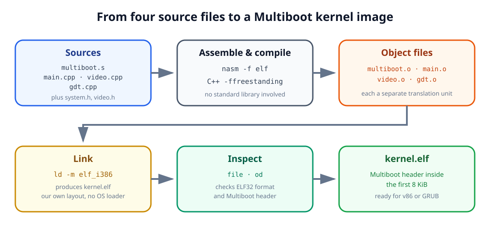

<div class="lesson-meta">

<div class="lesson-meta__eyebrow">AOS TUTORIALS · LESSON 03</div>

<p class="lesson-meta__summary"><strong>Stop writing your own bootloader, and start writing your kernel in C++</strong></p>

<p class="lesson-meta__topics">
  <kbd>C++</kbd>
  <kbd>GRUB</kbd>
  <kbd>Multiboot</kbd>
  <kbd>Linker scripts</kbd>
</p>

</div>

## What you will build

[Lesson 02](../02-entering-protected-mode/) ended with a real
milestone: a boot sector that built its own GDT, switched the CPU into 32-bit
protected mode by hand, and jumped into a kernel that wrote
`Protected mode is active.` straight into VGA memory. Every single step of
that transition was ours - which also means every single step was something
we had to get exactly right, in raw assembly, before anything else could run.

That does not scale. A real kernel is thousands of lines long, touches dozens
of subsystems, and benefits enormously from a language with functions,
structures, and classes. This lesson makes two changes at once:

1. Replace our hand-rolled boot sector with **GRUB**, a general-purpose
   bootloader that already knows how to find a kernel, load it, and switch
   the CPU into protected mode - as long as our kernel speaks its language,
   the **Multiboot specification**.
2. Replace hand-written assembly with a small amount of **C++**, running
   without an operating system underneath it.

Concretely, you will produce a `kernel.elf` made of four source files:

| File | Responsibility |
|---|---|
| `multiboot.s` | Embed the Multiboot header and hand control to `kmain` |
| `system.h` | Shared types, port I/O helpers, and small runtime utilities |
| `video.h` / `video.cpp` | A `Video` class that prints text to the screen |
| `gdt.cpp` | Build our own GDT in C++, replacing GRUB's temporary one |
| `main.cpp` | `kmain`, the C++ entry point that ties everything together |



:::note[You are not getting a full C++ runtime]

Without an operating system underneath, most of what makes C++
comfortable - `new`/`delete`, exceptions, `dynamic_cast` - has nothing to
run on top of. Section 6 draws the line precisely: what we can use today,
and what has to wait for a kernel that provides its own runtime support.

:::

## 1. Why hand the boot process to GRUB?

Every one of our previous boot sectors did the same job by hand: find the
kernel on disk, load it sector by sector, and jump to it. That is fine for a
512-byte experiment, but it is also exactly the kind of repetitive,
error-prone plumbing that a general tool should do for you instead.

**GRUB** (the Grand Unified Bootloader) is that tool. It is a real bootloader
capable of loading an operating system from several kinds of storage, over
several kinds of filesystem, in several executable formats - all of it
configured once, in a text file, rather than hand-assembled every time:

| Capability | What it buys us |
|---|---|
| Multiple disk types | Floppy, hard disk, or network boot from the same kernel image |
| Multiple filesystems | FAT, ext2/3, and others - no custom disk-reading code needed |
| Multiple executable formats | ELF, a.out, and more, recognized automatically |
| Compressed images | `gzip`-compressed kernels, decompressed on the fly |

GRUB does not, however, load just *any* program into memory and jump to it
blindly - it has no way to know where your code expects to run, or whether
it is even a kernel at all. So GRUB only agrees to boot something that follows
a documented contract: the **Multiboot specification**. Meet that contract,
and GRUB will load your kernel, place it in 32-bit protected mode, and jump
straight into it - all the assembly from Lesson 02 handled for you, for free.

## 2. The Multiboot contract

To be Multiboot-compliant, a kernel must satisfy two requirements:

1. It must be a 32-bit executable.
2. It must contain a **Multiboot header**: a small, fixed-format block, 4-byte
   aligned, located entirely within the first 8192 bytes of the file.

The header is 32 bytes wide when every optional field is used:

| Offset | Field | Purpose |
|---:|---|---|
| 0 | Magic field | The fixed value `0x1BADB002`, identifying a Multiboot header |
| 4 | Flags | Which optional features this kernel requests |
| 8 | Checksum | `magic + flags + checksum` must sum to zero |
| 12 | Header address | Only if flags bit 16 is set: linear address of the header itself |
| 16 | Load address | Only if flags bit 16 is set: where the `.text` segment begins in memory |
| 20 | Load end address | Only if flags bit 16 is set: end of the data to load from the file |
| 24 | BSS end address | Only if flags bit 16 is set: end of the uninitialized-data region |
| 28 | Entry address | Only if flags bit 16 is set: address of the first instruction to run |

Of the flags bits, three matter here:

- **Bit 0** - load modules, if any, on 4 KiB boundaries.
- **Bit 1** - populate a memory-information structure for us before boot.
- **Bit 16** - the header itself supplies the four address fields above,
  instead of GRUB reading them from the file's own ELF headers.

:::caution[Important]

Our kernel sets only bits 0 and 1. Because bit 16 is off, GRUB reads the
load addresses from the ELF program headers our linker already produces.
The kernel therefore uses the compact three-field header shown in Section 5.

:::

Once GRUB has loaded the kernel and validated its header, it fills in a
second structure, `multiboot_info`, describing what it found - available
memory, the boot device, and more - and hands a pointer to it directly to
our code:

```cpp
typedef struct multiboot_memory_map_entry
{
    unsigned long size;
    unsigned long address_low;
    unsigned long address_high;
    unsigned long length_low;
    unsigned long length_high;
    unsigned long type;
} multiboot_memory_map_entry;

typedef struct multiboot_info
{
    unsigned long flags;
    unsigned long mem_lower;
    unsigned long mem_upper;
    unsigned long boot_device;
    unsigned long cmdline;
    unsigned long mods_count;
    unsigned long mods_addr;
    unsigned long symbols[4];
    unsigned long mmap_length;
    unsigned long mmap_addr;
} multiboot_info_t;
```

The `flags` field tells us which of the other fields are actually valid: bit
0 set means `mem_lower` and `mem_upper` hold real values (conventional and
extended memory, both in kilobytes); bit 1 set means `boot_device` identifies
which drive GRUB booted from; and bit 6 set means `mmap_addr` and
`mmap_length` describe a sequence of variable-length memory-map entries.
Loaders do not have to provide all three forms. Section 11 checks each flag
before touching the corresponding fields.


## 3. From source files to a linked image

Before writing the header, it helps to slow down and name what a linker
actually does - Lessons 00 through 02 never needed one, since NASM's flat
binary output *is* the finished image. C++ changes that: four separate
source files must become one program, and something has to do the combining.

Say we compile two tiny C files:

<table>
<tr><th>one.c</th><th>two.c</th></tr>
<tr><td>

```c
int a;
extern void func();
void main() {
    func();
}
```

</td><td>

```c
extern int a;
int b = 10;
void func() {
    a = 5;
    b = 2;
}
```

</td></tr>
</table>

A compiler works one file at a time. Compiling `one.c` alone produces an
**object file**, `one.o` - machine code for `main`, plus an unresolved
reference to `func`, a symbol this file never defines. Only when a **linker**
combines `one.o` and `two.o` does `func()` finally resolve to real code, and
does `a` in `two.c` resolve to the storage declared in `one.c`. That
resolving-and-combining step is exactly what turns a pile of separately
compiled pieces into one runnable program.

While combining object files, the linker also groups their contents by
purpose into **sections**, so that similar data ends up next to similar
data. Three sections cover almost everything a program needs:

1. **`.text`** - the compiled instructions themselves, such as the code
   generated for `main` and `func`.
2. **`.data`** - initialized global and static variables with a real value,
   such as `b` in `two.c`.
3. **`.bss`** - global and static variables with no initial value, such as
   `a` in `one.c`. Nothing needs to be stored on disk for these - the loader
   just needs to reserve zeroed space - so `.bss` costs no file space at all.

```text
+--------+
|  text  |
+--------+
|  data  |
+--------+
|  bss   |
+--------+
```

On a normal desktop OS, the linker bundled with your compiler already knows
the memory layout that OS expects, and quietly builds it for you. We are not
targeting any OS - there is no default layout to borrow - so we have to
describe the one our kernel needs ourselves, in a small file called a
**linker script**.

## 4. The linker script: link.lds

A linker script controls exactly which sections end up in the final
executable, in what order, and at what addresses. Ours is short enough to
read in one pass:

```text
ENTRY(entry)

SECTIONS
{
    . = 0x00100000;

    .text : ALIGN(4096)
    {
        code = .;
        KEEP(*(.multiboot))
        *(.text*)
    }

    .rodata : ALIGN(4096)
    {
        *(.rodata*)
    }

    .data : ALIGN(4096)
    {
        data = .;
        *(.data*)
    }

    .bss : ALIGN(4096)
    {
        bss = .;
        *(COMMON)
        *(.bss*)
        *(.stack)
    }

    end = .;

    /DISCARD/ :
    {
        *(.note*)
        *(.indent)
        *(.comment)
        *(.stab)
        *(.stabstr)
        *(.eh_frame*)
    }
}
```

Reading it from the top:

- `ENTRY(entry)` names `entry` as the very first instruction to execute -
  Section 5 defines that label.
- `.` is the **location counter**: the linker's current address while
  laying out the file. Setting it to `0x00100000` (1 MiB) means everything
  that follows is placed starting there - the conventional load address for
  a Multiboot kernel, safely above the low-memory quirks Lesson 02 spent so
  much time on.
- `code = .;` captures the location counter's value *right now*, before any
  bytes are placed, into a plain symbol named `code`. `data`, `bss`, and
  `end` mark the other section boundaries in the same way.
- `KEEP(*(.multiboot))` puts the Multiboot header first and prevents the
  linker from discarding it, keeping the header inside the first 8 KiB where
  a Multiboot loader looks for it.
- `*(.text*)` means "pull in every input section whose name starts with
  `.text`, from every object file, here." The same pattern repeats for
  `.rodata*`, `.*data*`, `.bss*`, and `COMMON` (the traditional home for
  uninitialized global variables before `.bss` existed).
- `ALIGN(4096)` advances the location counter up to the next 4 KiB boundary
  - a size we will reuse constantly once paging enters the picture, so it is
  worth aligning to it now.
- `*(.stack)` reserves room for a section literally named `.stack`, placed
  after that same alignment - Section 5 defines it, and it is where our
  kernel's stack will actually live.
- `/DISCARD/` throws away debugging and metadata sections our own kernel has
  no use for, keeping the final image lean.

## 5. Embedding the Multiboot header: multiboot.s

With the linker script placing `.multiboot` first, we can write the file that
declares the header and hands the loader's runtime values to our C++ code:

```asm
%define MULTIBOOT_HEADER_MAGIC 0x1BADB002
%define MULTIBOOT_HEADER_FLAGS 0x00000003
%define MULTIBOOT_CHECKSUM -(MULTIBOOT_HEADER_MAGIC + MULTIBOOT_HEADER_FLAGS)

[BITS 32]

SECTION .multiboot
ALIGN 4
multiboot_header:
  dd MULTIBOOT_HEADER_MAGIC
  dd MULTIBOOT_HEADER_FLAGS
  dd MULTIBOOT_CHECKSUM

SECTION .text
GLOBAL entry
EXTERN kmain

entry:
  mov esp, stack

  push ebx
  push eax
  call kmain

.hang:
  cli
  hlt
  jmp .hang

SECTION .stack nobits
ALIGN 16
resb 0x10000
stack:
```

A few details are worth slowing down for:

:::note[Two different magic numbers]

`0x1BADB002` identifies the header stored in the ELF file. A successful
Multiboot loader later places the different value `0x2BADB002` in `EAX`.
Keeping those two roles separate is what lets the kernel verify that its
runtime handoff is genuine.

:::

- `mov esp, stack` is the entire stack setup. `stack` is the label placed
  *after* `resb 0x10000` in `SECTION .stack`, so it names the top of that
  64 KiB region - exactly where a downward-growing x86 stack should start.
- `push ebx` then `push eax` place `kmain`'s two arguments
  on the stack in reverse order, C calling-convention style: the loader left
  the `multiboot_info` pointer in `EBX` and the magic number `0x2BADB002`
  in `EAX`, and we forward both into `kmain`.

## 6. What C++ can (and cannot) do without an operating system

Compared to C, C++ quietly asks its runtime environment for more help. Most
of that help normally comes from the OS or from library startup code you
never see. We have neither, so a short honest inventory matters before
writing a single class:

| Feature | Status here | Why |
|---|---|---|
| `new` / `delete` | Not yet | Need a working heap allocator, which we have not built |
| Exceptions | Not yet | Need unwinding support the runtime would normally provide |
| `dynamic_cast` / `typeid` (RTTI) | Not yet | Need runtime type information the compiler would normally emit and support |
| Global and static objects | Not yet | Constructors would need to run before `kmain`, via linker/runtime setup we have not built |
| Pure virtual functions | Only with care | A stub is needed for what happens if one is ever called without an override |
| Classes, inheritance, local objects | **Available now** | These need no environment beyond what the compiler itself generates |

This is not a permanent restriction - a later lesson can absolutely build a
heap and wire up global constructors. It is simply not needed yet, and
skipping it keeps this lesson's kernel small enough to read start to finish.
Everything below only relies on the last row of that table: classes,
inheritance, and objects that live on the stack or as members of other
objects - exactly what `Video` in Section 9 and `GDTEntry` in Section 10 need.

:::note[Two small compiler stubs]

`main.cpp` also defines two empty functions, `__main()` and `_alloca()`.
Some C++ toolchains (Cygwin's among them) emit calls to these as part of
their normal startup sequence; without an implementation, the linker
would refuse to finish. Empty bodies are enough - we simply are not using
the features that would make them do real work.

:::

## 7. Low-level helpers: system.h

`system.h` is where the handful of things every other file needs to share
lives: fixed-width types, the two instructions that talk to hardware ports,
and declarations for the small utility functions Section 8 implements.

```cpp
#ifndef SYSTEM_H_
#define SYSTEM_H_

#define MULTIBOOT_BOOTLOADER_MAGIC 0x2BADB002

typedef unsigned char BYTE;
typedef unsigned short WORD;
typedef unsigned int DWORD;
typedef unsigned long long QWORD;

typedef struct multiboot_memory_map_entry
{
    DWORD size;
    DWORD address_low;
    DWORD address_high;
    DWORD length_low;
    DWORD length_high;
    DWORD type;
} multiboot_memory_map_entry;

typedef struct multiboot_info
{
	DWORD flags;
	DWORD mem_lower;
	DWORD mem_upper;
	DWORD boot_device;
	DWORD cmdline;
	DWORD mods_count;
	DWORD mods_addr;
	DWORD symbols[4];
	DWORD mmap_length;
	DWORD mmap_addr;
} multiboot_info;

inline unsigned char inb (unsigned short port)
{
    unsigned char rv;
   asm volatile("inb %1, %0" : "=a" (rv) : "dN" (port));
    return rv;
}

inline void outb (unsigned short port, unsigned char data)
{
    asm volatile("outb %1, %0" : : "dN" (port), "a" (data));
}

BYTE *memcpy(BYTE *dest, const BYTE *src, int count);
BYTE *memset(BYTE *dest, const BYTE val, int count);
void intToString (char *buf, char base, int number);
void GDTSetup();

#endif /*SYSTEM_H_*/
```

`BYTE`, `WORD`, `DWORD`, and `QWORD` simply give the 8/16/32/64-bit unsigned
sizes memorable names - the same widths Lesson 02 wrote as raw hex, now
spelled out.

`inb` and `outb` read and write a single byte on a hardware I/O port - the
same doorway Lesson 02's VGA discussion mentioned but never used. C and C++
have no built-in syntax for "talk to port `0x3D4`," so these two functions
drop into **inline assembly** to do it directly:

```text
asm volatile("inb %1, %0" : "=a" (rv) : "dN" (port));
```

Reading the three parts after the instruction string:

- `"=a" (rv)` is the **output**: `%0` refers to it, and `=a` tells the
  compiler to fetch the result from register `EAX`/`AL` into `rv`.
- `"dN" (port)` is the **input**: `%1` refers to it, and `dN` means "put
  `port` in `DX` if it is a runtime value, or encode it directly as an
  immediate byte if the compiler already knows it at compile time."
- `volatile` tells the compiler not to optimize this instruction away or
  reorder it - a port read or write is a real side effect on hardware, not
  a pure calculation it is free to skip or cache.

These two live in the header, marked `inline`, specifically so that calling
`inb(0x3D4)` costs nothing beyond the instruction itself: the compiler
substitutes the assembly directly at the call site, the same way a macro
would, with none of the overhead of an actual function call. `updateCursor()`
in Section 9 is what actually puts them to work.

## 8. Three small utilities: memcpy, memset, and intToString

Freestanding C++ (the `-nostdlib -nostdinc -fno-builtin` flags Section 12's
Makefile passes) means the standard library is simply not there - not even
`memcpy`. Three tiny implementations cover everything the rest of the kernel
needs.

```cpp
BYTE* memcpy(BYTE *dest, const BYTE *src, int count)
{
    int i;
	for(i=0; i<count; i++)
		dest[i] = src[i];
	return dest;
}

BYTE* memset(BYTE *dest, BYTE val, int count)
{
	int i;
	for(i=0; i<count; i++)
		dest[i] = val;
	return dest;
}
```

Both are exactly as literal as they sound: copy `count` bytes one at a time,
or stamp the same byte `count` times. `GDTSetup()` in Section 10 leans on
`memset` to zero the required null GDT entry.

`intToString` is the one with real logic in it - it renders an integer as
decimal (`base = 'd'`), unsigned decimal (`'u'`), or hexadecimal (`'x'`),
into a caller-provided buffer:

```cpp
void intToString (char *buf, char base, int number)
{
	static char digits[] = "0123456789abcdef";
	char *p = buf;
	unsigned long uns = number;
	int divisor = 10;

	if (base == 'd' && number < 0) {
		*p = '-';
		p++;	buf++;
		uns = -number;
	} else if (base == 'x') {
		divisor = 16;
		*p = '0';
		*(p+1) = 'x';
		p +=2;
		buf +=2;
	}	else if(base != 'u')
		*buf = 0;

	do {
		long remainder = uns % divisor;
		*p = digits[remainder];
		*p++;
	}  while (uns /= divisor);

	*p = 0;

	char *head, *tail;
	head	= buf;
	tail = p - 1;

	while (head < tail) {
		char tmp = *head;
		*head = *tail;
		*tail = tmp;
		head++;
		tail--;
	}
}
```

Walking through it in the order it actually runs:

1. **Sign and prefix.** A negative decimal number gets a leading `-`, and
   its magnitude is taken via `uns = -number`. A hexadecimal number instead
   gets a leading `0x`. Either way, `p` moves past whatever prefix was just
   written, so digit-writing always starts from a clean position.
2. **Extracting digits, one at a time, from the wrong end.** Dividing by
   `divisor` (10 or 16) and taking the remainder peels off the
   *least-significant* digit first - for `12987` in decimal, that is `7`,
   then `8`, then `9`, then `2`, then `1`. Each digit is looked up in
   `digits[]` and written to `p`, so the string comes out backwards:
   `"78921"`.

   !!! note "That `*p++;` line looks unusual, and it is - but it works"

       Operator precedence makes `*p++` mean "dereference `p`, *then*
       increment `p`" - the dereferenced value here is simply discarded as a
       statement. It reads like a typo for a plain `p++;`, and functionally
       that is exactly what it does; the surrounding line above it is what
       actually stores the digit.

3. **Reversing the string in place.** Since the digits came out backwards, a
   simple two-pointer swap - `head` from the front, `tail` from the back,
   walking toward each other - flips `"78921"` into `"12987"` before
   returning.

## 9. The Video class: printing without BIOS, again

Lesson 02's kernel wrote directly to `0xB8000` with a handful of loose
assembly instructions. `Video` wraps that same idea - and that same memory
address - behind a small class with a cursor, a current color, and a
`printf`.

```cpp
#ifndef VIDEO_H_
#define VIDEO_H_

#include"system.h"

class Video
{
private:
  // cursor's position
  int _x, _y;

  // current attribute
  BYTE _attribute;

  // pointer to video memory
  BYTE *mem;

  // screen width and height
  const int width, height;

public:
  Video();

  void clear();
  void put(char c);
  void printf (const char *format, ...);
  void moveTo(int x, int y);
  void updateCursor();
  void scroll(int dy);
  void attribute(BYTE attribute);
  BYTE attribute() const;
  int x() const;
  int y() const;
};

#endif /*VIDEO_H_*/
```

The private members are the entire state a text-mode screen needs: `_x, _y`
for the cursor, `_attribute` for the current text color, `mem` pointing at
video memory, and `width`/`height` fixed at the standard 80×25.

### Construction

```cpp
Video::Video()
  : _x(0),
    _y(0),
    _attribute(0x0f),
    mem(reinterpret_cast<BYTE*>(0xb8000)),
    width(80),
    height(25)
{
}
```

The cursor starts at the top-left corner, the attribute defaults to bright
white on black (`0x0f`), and `mem` is initialized once, in the constructor's
initializer list - `width` and `height` are declared `const`, so they can
only ever be set here, never reassigned later.

### Writing one character: put()

```cpp
void Video::put(char c)
{
    if(c == 0x08)
    {
        if(_x != 0) _x--;
    }
    else if(c == '\r')
    {
        _x= 0;
    }
    else if(c == '\n')
    {
        _x= 0;
        _y++;
    }
    else if(c >= ' ')
    {
        int index = (_y*width + _x) * 2;

        mem[index] = c;
        mem[index+1] = _attribute;

        _x++;
    }

    if(_x >= width)
    {
        _x= 0;
        _y++;
    }

	if(_y >= height)
		scroll(_y-height+1);

    updateCursor();
}
```

`put` handles four cases in order: backspace (`0x08`, move left without
erasing), carriage return, newline, and finally ordinary printable
characters, written to `mem[index]`/`mem[index+1]` at
`(_y * width + _x) * 2` - the exact character/attribute pair layout Lesson
02 introduced for VGA text memory. After writing, `_x` advances by one; if
that pushes it past the last column, the cursor wraps to a new line, and if
*that* pushes `_y` past the last row, `scroll()` makes room. Every call ends
by pushing the new position out to the real hardware cursor.

### Moving the hardware cursor: updateCursor()

```cpp
void Video::updateCursor()
{
  WORD loc = (_y * width) + _x;

  outb(0x3D4, 0x0F);
  outb(0x3D5,  loc & 0xFF);
  outb(0x3D4, 0x0E);
  outb(0x3D5,   (loc>>8) &0xFF);
}
```

The blinking cursor you actually see on screen is separate hardware from
the character/attribute bytes `put` just wrote - it is controlled by the
**CRT controller (CRTC)**, addressed through two I/O ports rather than
memory:

| Port | Role |
|---|---|
| `0x3D4` | Index register - selects *which* CRTC register comes next |
| `0x3D5` | Data register - the value for whichever register was just selected |

Since the cursor position is a single 16-bit value split across two 8-bit
registers, setting it takes four `outb` calls: select register `0x0F`,
write the low byte; select register `0x0E`, write the high byte. This is
exactly the pair of helper functions from Section 7 finally earning their
keep.

### Scrolling and clearing

```cpp
void Video::scroll(int dy)
{
  if(dy > 0)
  {
      memcpy (mem, mem + (dy * width * 2),
              (height - dy) * width * 2);

      int loc = (height-dy)*width*2;
      for (int i=0; i < dy*width*2; i+=2)
      {
        mem[loc+i] = ' ';
        mem[loc+i+1] = _attribute;
      }
  }
}

void Video::clear()
{
  for (int x=0; x<width; ++x)
  {
    for (int y=0; y<height; ++y)
    {
      put(' ');
    }
  }

  _x = 0;
  _y = 0;
}
```

`scroll` moves everything from line `dy` onward up to the top with one
`memcpy`, then blanks the newly empty lines it left behind at the bottom.
`clear` takes the simplest possible route to a blank screen: print a space
into every cell by calling `put`, then reset the cursor - reusing the exact
same code path a normal character would take, rather than writing memory
directly a second way.

### A tiny printf

```cpp
void Video::printf (const char *format, ...)
{
	const char **arg = reinterpret_cast<const char **> (&format);
	char c;
	int num;
	char buf[20];

	arg++;

	while((c = *format++) != 0)
	{
		if (c == '%') {
			const char *p;
			c = *format++;
			switch (c) {
				case '%':
					put('%');
					break;
				case 'd':
				case 'u':
				case 'x':
					num = *(reinterpret_cast<int *> (arg));
					arg++;
					intToString (buf, c, num);
					for (p = buf; *p != 0; p++)
						put(*p);
					break;

				case 's':
					for (p = *arg; *p != 0; p++)
						put(*p);
					arg++;
					break;
				default:
					num = *(reinterpret_cast<int *> (arg));
					arg++;
					put (num);
					break;
			}

		} else {
			put(c);
		}
	}
}
```

There is no `<cstdarg>` here - no operating system C library to provide
one - so `printf` reaches its variadic arguments the way `va_list` would
have to under the hood anyway: by taking the address of its last named
parameter, `format`, and treating everything *after* it on the stack as an
array of pointers. `arg++` steps over `format` itself to reach the first
real argument, and each `case` advances `arg` again after consuming one.

The format specifiers it understands are deliberately minimal:

| Specifier | Meaning |
|---|---|
| `%d` | Signed decimal integer |
| `%u` | Unsigned decimal integer |
| `%x` | Hexadecimal integer |
| `%s` | Null-terminated string |
| `%%` | A literal `%` |

`%d`/`%u`/`%x` all funnel through the same `intToString` from Section 8,
just with a different `base` character; `%s` walks the given string one
character at a time. Everything else - any character that is not a `%` -
goes straight to `put` unchanged. Section 11's `kmain` is what finally puts
this to use, printing GRUB's memory and boot-device information.

## 10. A protected-mode GDT, now in C++

GRUB already switched the CPU into protected mode before jumping to our
kernel, using a GDT of its own - but that GDT is temporary and not something
we control or even know the exact shape of. `gdt.cpp` builds a proper one,
using the exact same 8-byte descriptor Lesson 02 wrote as raw binary,
expressed here as a named C++ bitfield struct instead.

```cpp
#include "system.h"

struct GDTEntry
{
    WORD limit_1;			// segment limit bits 0->15
    WORD base_1;		// segment base address bits 0->15
	BYTE base_2;			// segment base address bits 16->23

	BYTE type:4;			// segment type
	BYTE system:1;		// descriptor type
	BYTE dpl:2;				// descriptor privilige level
	BYTE present:1;		// segment present in memory

    BYTE limit_2:4;			// segment limit bits 16->19
	BYTE avl:1;				// available bit
	BYTE zero:1;			// zero field for 32 bit architecture
	BYTE db:1;				// D/B field
	BYTE granularity:1;	// Granularity field

    BYTE base_3;			// segment base address bits 24->31
} __attribute__((packed));

struct GDTR {
    WORD limit;
    DWORD base;
} __attribute__((packed));

#define MAX_ENTRIES 3
GDTEntry gdt[MAX_ENTRIES];
GDTR gptr;
```

`__attribute__((packed))` on both structs tells GCC not to insert its usual
padding between fields - without it, the compiler would be free to round
`GDTEntry` up to a "nicer" size, and the CPU expects these exact 8 bytes
back to back, with no gaps, no exceptions.

### Filling in one descriptor

```cpp
void setGDTEntry(int num,  bool isCode, int dpl)
{	if(num>= MAX_ENTRIES)
		return;
    gdt[num].base_1 = 0;
    gdt[num].base_2 = 0;
    gdt[num].base_3 = 0;

    gdt[num].limit_1 = 0xFFFF;
    gdt[num].limit_2 = 0xF;

	gdt[num].type = (isCode)?0xb:0x3;
    gdt[num].system = 1;
    gdt[num].dpl = (dpl & 3);
    gdt[num].present = 1;

	gdt[num].avl = 0;
    gdt[num].db = 1;
	gdt[num].zero = 0;
	gdt[num].granularity = 1;
}
```

Every field here matches a value Lesson 02 wrote out as raw hex: base `0`
and limit `0xFFFFF` (split across `limit_1`/`limit_2`, scaled to 4 GiB by
`granularity = 1`), `present = 1`, `db = 1` for 32-bit segments, and `dpl`
masked to its low two bits so a caller can never accidentally request a
privilege level outside 0-3. The one real choice this function makes is
`type`: `0xb` for an executable code segment, `0x3` for a writable data
segment - the same distinction as Lesson 02's access bytes `0x9A` versus
`0x92`, just split into named fields instead of packed binary literals.

### Loading the table

```cpp
void GDTSetup()
{
    gptr.limit = (sizeof(GDTEntry) * MAX_ENTRIES)-1 ;
    gptr.base = (DWORD)&gdt;

	BYTE *entry = reinterpret_cast<BYTE*>(gdt);
	memset(entry, 0, sizeof(GDTEntry));

    setGDTEntry(1, true, 0);
    setGDTEntry(2, false, 0);

	asm volatile ("lgdt %0          \n\
			 ljmp $8,$1f      \n\
			 1:               \n\
			 movw $16, %%ax    \n\
			 movw %%ax,  %%ss \n\
			 movw %%ax,  %%ds \n\
			 movw %%ax,  %%es \n\
			 movw %%ax,  %%fs \n\
			 movw %%ax,  %%gs"
		:: "m"(gptr));
}
```

The shape should feel familiar from Lesson 02's protected-mode transition,
even though the syntax has changed completely:

1. `gptr` is filled in exactly like Lesson 02's `gdtPointer` - a 16-bit
   limit and a 32-bit linear base, ready for `LGDT`.
2. Entry 0 is explicitly zeroed with `memset` - the required null
   descriptor, built here in code instead of a `dq 0` in assembly.
3. `setGDTEntry(1, true, 0)` and `setGDTEntry(2, false, 0)` build the flat
   code and data descriptors, both at privilege level 0.
4. The inline assembly block is this lesson's entire "mode switch": `lgdt`
   loads the new table, `ljmp $8,$1f` is a far jump to a local label
   (`1:`, immediately below) through selector `0x08` - reloading `CS` from
   our new code descriptor, exactly the way Lesson 02's far jump did. The
   five `movw` instructions afterward load selector `0x10` into every
   remaining segment register, replacing whatever GRUB's temporary GDT had
   left there.

GRUB got us into protected mode; this function is what makes protected mode
*ours*.

## 11. main.cpp: kmain, the real entry point

Everything so far exists to make this function possible: a Multiboot loader
validated our header and jumped into `multiboot.s`, which forwarded its two
register values and called `kmain`. `main.cpp` also happens to be where
`memcpy`, `memset`, and `intToString` are actually defined - the same three
functions Section 8 already walked through in full, so only `kmain` itself is
repeated here:

```cpp
static DWORD usableMemoryKilobytes(const multiboot_info *information)
{
    DWORD total = 0;
    DWORD cursor = information->mmap_addr;
    DWORD end = cursor + information->mmap_length;

    while (cursor < end)
    {
        const multiboot_memory_map_entry *entry =
            reinterpret_cast<const multiboot_memory_map_entry *>(cursor);

        if (entry->size < 20)
            break;

        if (entry->type == 1 && entry->length_high == 0)
            total += entry->length_low / 1024;

        cursor += entry->size + sizeof(entry->size);
    }

    return total;
}

extern "C" void kmain(DWORD magic, multiboot_info *information)
{
    GDTSetup();

    Video video;
    const char *devices[] = { "floppy A", "hard disk" };
    video.clear();

    if (magic != MULTIBOOT_BOOTLOADER_MAGIC)
    {
        video.printf("Assalamou Alaikoum without Multiboot\n");
        video.printf("Invalid magic number %x\n", magic);
    }
    else
    {
        video.printf("Assalamou Alaikoum from Multiboot\n");

        if (information->flags & 1)
        {
            video.printf("Lower memory = %uKB\n", information->mem_lower);
            video.printf("Upper memory = %uKB\n", information->mem_upper);
        }
        else if (information->flags & (1 << 6))
        {
            video.printf(
                "Usable memory = %uKB (memory map)\n",
                usableMemoryKilobytes(information));
        }
        else
        {
            video.printf("Memory information = not provided\n");
        }

        if (information->flags & 2)
        {
            char bootDevice = (information->boot_device >> 24) & 0xF;
            const char *device = bootDevice ? devices[1] : devices[0];
            video.printf("Boot device = %s\n", device);
        }
        else
        {
            video.printf("Boot device = not provided\n");
        }
    }

    while (1)
        asm volatile("cli; hlt");
}
```

In order:

- `extern "C"` disables C++ **name mangling** for `kmain` - without it, the
  compiler would encode the parameter types into the symbol name, and
  `multiboot.s`'s `call kmain` would find nothing to link against.
- `GDTSetup()` runs first, installing our own descriptors before anything
  else depends on protected mode behaving predictably.
- `Video video;` constructs directly on the stack - a local object, exactly the
  case Section 6 flagged as safe without a heap or global-constructor
  support.
- The magic-number check confirms a Multiboot-compatible loader actually
  brought us here; either way, a greeting prints using the `Video::printf`
  Section 9 just built.
- The runtime flags gate every optional field. The kernel accepts either
  the compact lower/upper-memory pair from bit 0 or the richer memory map
  from bit 6. Type 1 map entries identify usable RAM.
- `boot_device`'s top byte identifies the BIOS drive; a two-entry lookup
  table turns it into a human-readable name. When a direct loader did not
  boot from a disk, the kernel reports that the field was not provided.
- The final `cli; hlt` loop halts once there is nothing left to report - there is
  still no interrupt table to safely return control to.

## 12. Building and running the kernel

The repository Makefile assembles the entry stub as ELF32, compiles the C++
without a hosted runtime, and links everything at `0x00100000`:

```sh
make -C "lesson 03" kernel
make -C "lesson 03" inspect
```

The inspection step verifies both the executable format and the header:

```text
format: ... ELF 32-bit ... Intel 80386 ...
multiboot header: 1badb002
```

### Run it in your browser

For this playground, v86 implements the Multiboot loader contract directly.
It loads the same `kernel.elf`, places the runtime magic in `EAX`, places the
information pointer in `EBX`, and starts at `entry`. There is no GRUB menu or
CD-ROM image in this path.

<div
  data-aos-v86-playground
  lesson="lesson-03"
  title="Lesson 03 · Start the C++ kernel"
  media="multiboot"
  artifact="lesson-03.elf"
  memory-mib="32"
  expected-output="Boot device = not provided"
></div>

v86 supplies a Multiboot memory map (runtime flag 6) for this direct-loading
path, rather than the older lower/upper-memory fields. It also supplies no
boot-device field because no disk was involved. The browser output therefore
looks like this:

```text
Assalamou Alaikoum from Multiboot
Usable memory = ...KB (memory map)
Boot device = not provided
```

`kernel.elf` is also a normal Multiboot-compliant kernel that GRUB can load.
To follow the original GRUB route, prepare a floppy image containing GRUB,
copy the kernel onto it, and add a small configuration file:

```text
default 0

#Entry 0:
title Arabian OS
root (fd0)
kernel /kernel.elf
```

`root (fd0)` tells GRUB which drive to read from, and `kernel /kernel.elf`
names the file to load and boot. Copy `kernel.elf` to the image's root
directory, save `menu.cfg` in its `boot` directory, and the floppy is ready.

Boot it in an emulator such as Bochs or QEMU, and GRUB's own menu appears
first - pick the single entry, and the machine hands control to our kernel:

```text
Assalamou Alaikoum from Multiboot
Lower memory = 639KB
Upper memory = 31744KB
Boot device = floppy A
```

The exact memory figures will vary by machine - what matters is that every
line came from `mbi`, the structure the loader built and handed to `kmain`,
printed through a `printf` we wrote ourselves, on a screen managed by a
`Video` object instead of loose assembly.

## 13. Troubleshooting

| Symptom | Likely cause |
|---|---|
| `undefined reference to 'kmain'` | The assembly declaration and the C++ `extern "C"` symbol do not agree |
| GRUB refuses to boot the kernel, or reports an invalid Multiboot image | The header is not 4-byte aligned, sits past byte 8192, or the checksum is wrong |
| `Invalid magic number` prints on screen | Something other than a Multiboot-compliant loader started the kernel |
| Linking produces a Mach-O or 64-bit file | Use an ELF32-capable linker and the Makefile's freestanding i386 target |
| The screen prints garbage instead of text | Check `_attribute`, the `(_y*width + _x) * 2` indexing, and that `mem` still points at `0xB8000` |
| The machine resets instead of printing anything | Check `GDTSetup()` runs before anything else, and that `esp` was set to `stack` in `multiboot.s` |

## 14. What you have learned

The shape of this lesson mirrors the shift it makes: less hand-written
plumbing, more of the actual kernel. You now have a kernel that:

- Declares a Multiboot header GRUB recognizes and validates.
- Uses a linker script to lay out `.text`, `.rodata`, `.data`, and `.bss`
  at a chosen load address, without any help from an OS toolchain default.
- Reads the `multiboot_info` structure its loader fills in, including
  available memory and an optional boot device.
- Prints to the screen through a small `Video` class with its own cursor,
  scrolling, and `printf`.
- Replaces GRUB's temporary GDT with one built and loaded from C++.
- Knows precisely which C++ features are safe to use without an operating
  system underneath - and which ones are not, yet.

The next lesson finally builds an IDT and starts handling interrupts - CPU
exceptions first, hardware devices soon after. Every low-level habit from
this lesson and the two before it - careful register discipline, exact
memory layouts, checking your assumptions against the CPU's actual rules -
carries forward unchanged.
